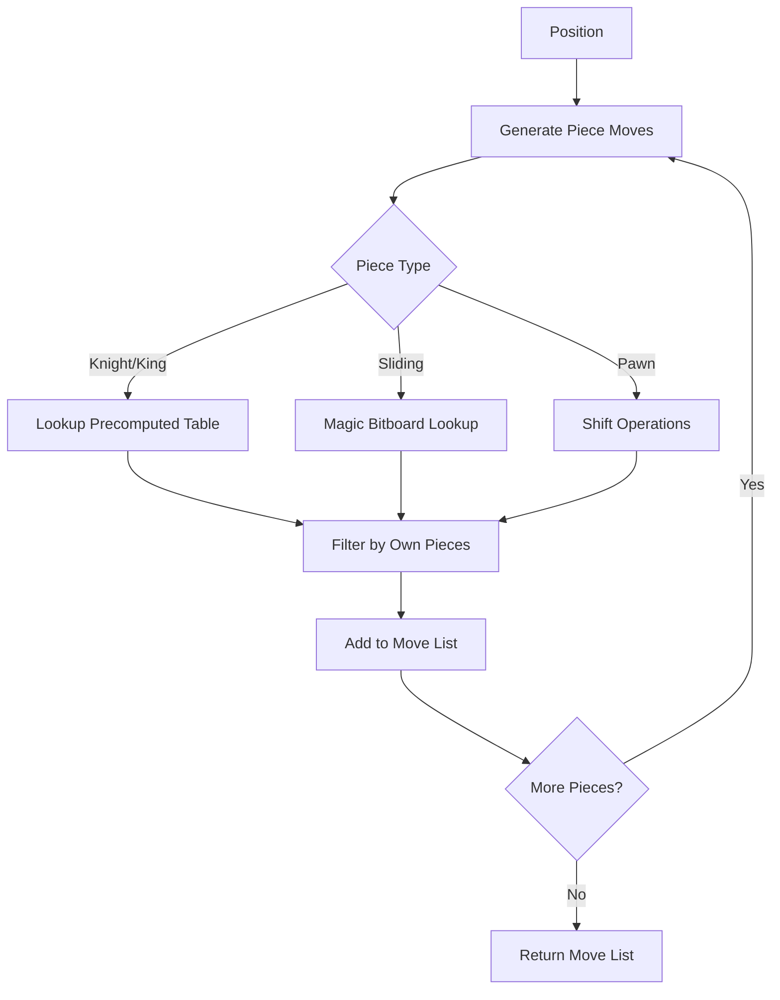
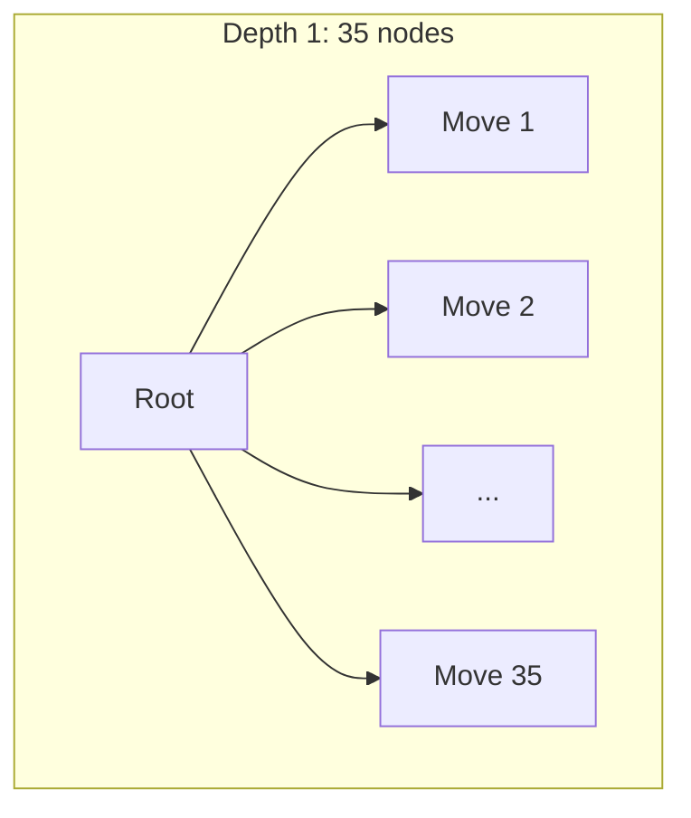
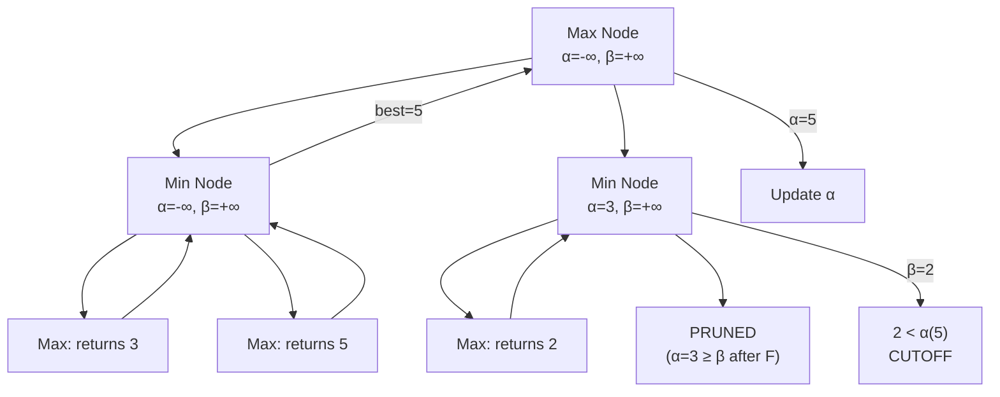
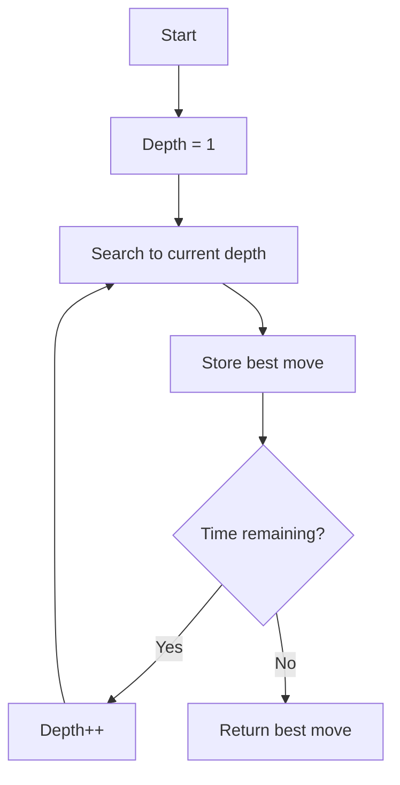
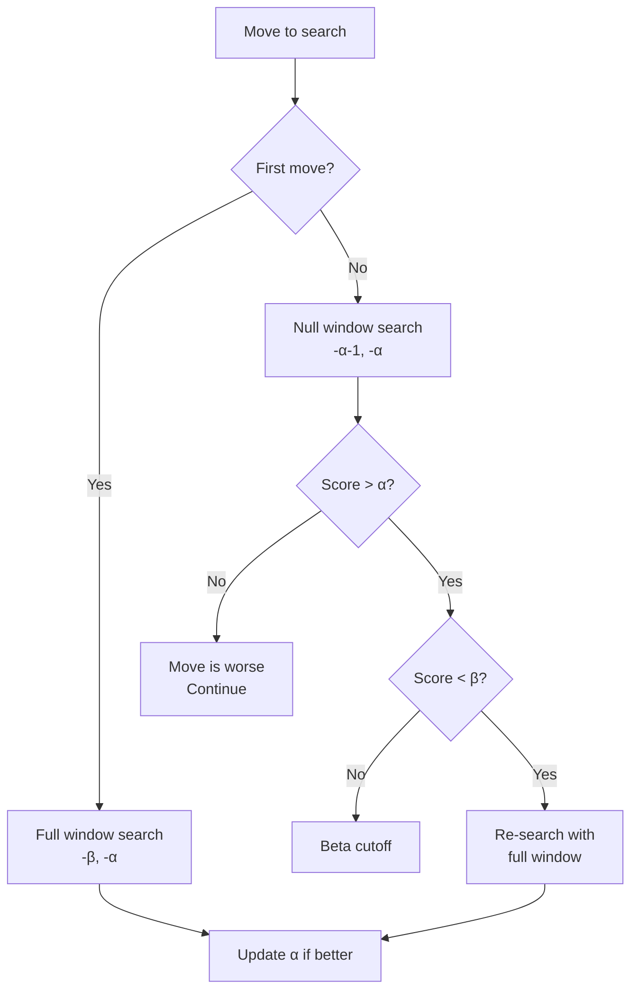
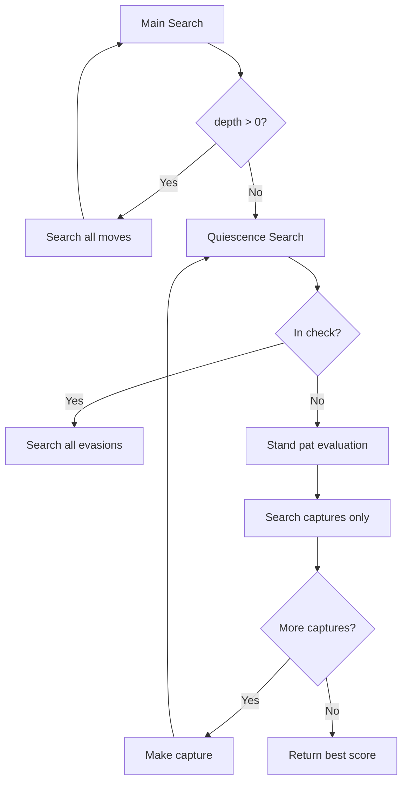
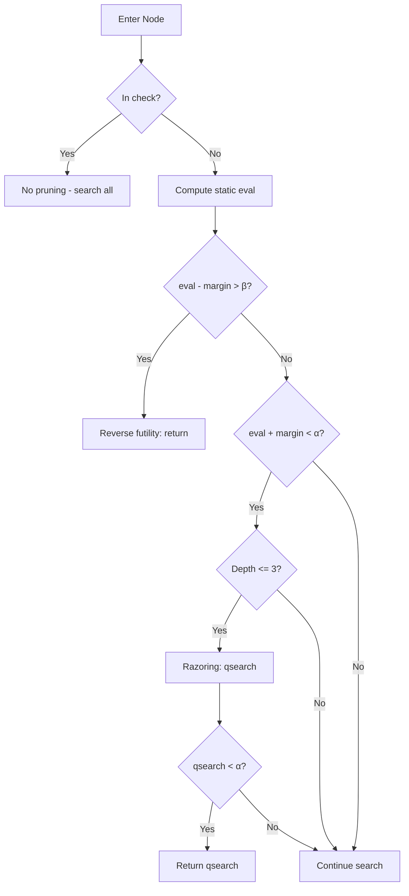

# Fundamentals of Chess Programming
## Expanded Outline

---

# Part I: Foundations

---

## Chapter 1: A Brief History of Chess Computers

### 1.1 The Theoretical Foundations
- Claude Shannon's 1950 paper "Programming a Computer for Playing Chess"
- The Shannon Number: estimating the game tree complexity (~10^120)
- Type A (brute force) vs Type B (selective) strategies
- Alan Turing's paper machine "Turochamp" (1948)
  - Hand-executed algorithm before computers could run it
  - Example game against a human

### 1.2 The Early Programs (1950s-1970s)
- Bernstein's program (1957) - first complete chess program
  - Ran on IBM 704, 8 minutes per move
  - Selected 7 "plausible" moves to explore
- MacHack VI (1967) - first to beat a human in tournament
  - Richard Greenblatt at MIT
  - Introduced transposition tables
- Chess 4.x series (Northwestern University)
  - Dominated early computer chess championships
  - Incremental improvements in search

### 1.3 Dedicated Hardware Era
- Belle (Ken Thompson, 1980s)
  - Custom hardware for move generation
  - First to reach master strength
- Chess Challenger and consumer products
- The commercialization of computer chess

### 1.4 Deep Blue and the Defeat of Kasparov
- The IBM project timeline
- Custom VLSI chips for chess
- 200 million positions per second
- The 1996 match (Kasparov wins 4-2)
- The 1997 rematch (Deep Blue wins 3.5-2.5)
- Controversy and legacy
- Diagram: Deep Blue's hardware architecture (Mermaid block diagram)

### 1.5 The Rise of Open Source
- Crafty (Bob Hyatt) - educational and influential
- Fruit 2.1 - the revolution in code clarity
  - Made advanced techniques accessible
  - History heuristic, LMR adoption
- Stockfish emerges (2008)
  - Fork of Glaurung
  - Community-driven development
  - Continuous improvement methodology

### 1.6 Neural Networks Enter the Scene
- AlphaZero (2017) - DeepMind's breakthrough
  - Self-play reinforcement learning
  - No human knowledge except rules
  - Defeated Stockfish 8 decisively
- Leela Chess Zero - open source recreation
- NNUE - Efficiently Updatable Neural Networks
  - Originated in Shogi (Yu Nasu)
  - Integrated into Stockfish (2020)
  - Classical search + neural evaluation

### 1.7 Where We Are Today
- Stockfish 16+ with NNUE
- Engine Elo ratings (~3500+)
- Centaur chess and analysis
- The role of engines in modern chess
- Ongoing research directions

---

## Chapter 2: Board Representation

### 2.1 The Naive Approach: 2D Arrays
```cpp
int board[8][8];
// EMPTY=0, W_PAWN=1, W_KNIGHT=2, ... B_KING=12
```
- Simple to understand
- Coordinate mapping: board[rank][file]
- Problems:
  - Bounds checking on every move
  - Slow for pattern detection
  - No efficient way to find "all white pieces"

### 2.2 Mailbox Representation
**8x8 Mailbox:**
- Flat array of 64 squares
- Index = rank * 8 + file
- Still need bounds checking

**10x12 Mailbox:**
```
  -1 -1 -1 -1 -1 -1 -1 -1 -1 -1
  -1 -1 -1 -1 -1 -1 -1 -1 -1 -1
  -1  r  n  b  q  k  b  n  r -1
  -1  p  p  p  p  p  p  p  p -1
  -1  .  .  .  .  .  .  .  . -1
  -1  .  .  .  .  .  .  .  . -1
  -1  .  .  .  .  .  .  .  . -1
  -1  .  .  .  .  .  .  .  . -1
  -1  P  P  P  P  P  P  P  P -1
  -1  R  N  B  Q  K  B  N  R -1
  -1 -1 -1 -1 -1 -1 -1 -1 -1 -1
  -1 -1 -1 -1 -1 -1 -1 -1 -1 -1
```
- Sentinel values (-1) for off-board detection
- Knight moves can't accidentally wrap
- Direction offsets: N=+10, NE=+11, E=+1, etc.

### 2.3 Piece Lists
- Maintain arrays of piece locations
- `white_pieces[] = {e1, d1, a1, h1, ...}`
- Fast iteration over pieces
- Must keep synchronized with board array
- Often combined with mailbox

### 2.4 Bitboards: The Modern Standard

**Why 64 bits is perfect:**
- One bit per square
- Fits in a single CPU register
- Hardware support for bit operations

**Basic representation:**
```cpp
typedef uint64_t Bitboard;

Bitboard white_pawns;
Bitboard white_knights;
Bitboard white_bishops;
// ... etc for all piece types

Bitboard white_pieces;  // Union of all white
Bitboard black_pieces;  // Union of all black
Bitboard occupied;      // All pieces
```

**Square mapping convention:**
```
a1=0, b1=1, c1=2, ... h1=7
a2=8, b2=9, ...
...
a8=56, b8=57, ... h8=63
```

**The elegance of set operations:**
```cpp
// All squares attacked by white
Bitboard white_attacks = pawn_attacks | knight_attacks | ...;

// Squares where black can safely move
Bitboard safe_squares = ~white_attacks;

// White pieces that are attacked
Bitboard hanging = white_pieces & black_attacks;

// Empty squares
Bitboard empty = ~occupied;
```

### 2.5 Essential Bit Operations
```cpp
// Set a bit (place a piece)
board |= (1ULL << square);

// Clear a bit (remove a piece)
board &= ~(1ULL << square);

// Test a bit (is square occupied?)
bool occupied = (board >> square) & 1;

// Population count (number of pieces)
int count = __builtin_popcountll(board);  // or _mm_popcnt_u64

// Find first set bit (find a piece)
int square = __builtin_ctzll(board);  // count trailing zeros

// Iterate over all set bits
while (board) {
    int sq = __builtin_ctzll(board);
    // process square
    board &= board - 1;  // clear lowest bit
}
```

### 2.6 Additional Game State
Beyond piece positions, we need:
```cpp
struct Position {
    Bitboard pieces[2][6];    // [color][piece_type]
    Bitboard occupied[2];     // [color]
    Bitboard all_occupied;

    int side_to_move;         // WHITE or BLACK
    int castling_rights;      // Bitmask: WK=1, WQ=2, BK=4, BQ=8
    int en_passant_square;    // Target square or NONE
    int halfmove_clock;       // For 50-move rule
    int fullmove_number;

    uint64_t hash;            // Zobrist hash (Chapter 9)
};
```

### 2.7 Diagram: Visual Comparison
```
Mermaid diagram showing:
- Memory layout of 2D array vs bitboard
- Example position in both representations
- Highlighting efficiency difference
```

---

## Chapter 3: Move Generation

### 3.1 What Constitutes a Legal Move
- Piece movement rules
- Cannot capture own pieces
- Cannot move through pieces (except knight)
- King cannot move into check
- Must escape check if in check
- Special moves: castling, en passant, promotion

### 3.2 Pseudo-Legal vs Legal Move Generation

**Pseudo-legal approach:**
1. Generate all moves ignoring pins and checks
2. Make each move
3. Check if own king is in check
4. If in check, move was illegal - unmake it

**Legal generation approach:**
1. Detect check and pins first
2. Generate only legal moves
3. More complex but fewer moves to test

**Trade-offs:**
- Pseudo-legal: simpler code, test legality later
- Legal: more upfront work, but every move is playable
- Most engines use pseudo-legal with legality check

### 3.3 Non-Sliding Pieces: Knights

**Knight attack pattern:**
```
. . . . . . . .
. . 1 . 1 . . .
. 1 . . . 1 . .
. . . N . . . .
. 1 . . . 1 . .
. . 1 . 1 . . .
. . . . . . . .
```

**Precomputed attack tables:**
```cpp
Bitboard KNIGHT_ATTACKS[64];  // Indexed by square

void init_knight_attacks() {
    for (int sq = 0; sq < 64; sq++) {
        Bitboard b = 1ULL << sq;
        KNIGHT_ATTACKS[sq] =
            ((b << 17) & ~FILE_A) |  // Up 2, right 1
            ((b << 15) & ~FILE_H) |  // Up 2, left 1
            ((b << 10) & ~(FILE_A | FILE_B)) |  // Up 1, right 2
            ((b << 6)  & ~(FILE_G | FILE_H)) |  // Up 1, left 2
            ((b >> 6)  & ~(FILE_A | FILE_B)) |  // Down 1, right 2
            ((b >> 10) & ~(FILE_G | FILE_H)) |  // Down 1, left 2
            ((b >> 15) & ~FILE_A) |  // Down 2, right 1
            ((b >> 17) & ~FILE_H);   // Down 2, left 1
    }
}

// Generate knight moves
Bitboard knights = pos.pieces[WHITE][KNIGHT];
while (knights) {
    int from = pop_lsb(&knights);
    Bitboard attacks = KNIGHT_ATTACKS[from] & ~pos.occupied[WHITE];
    while (attacks) {
        int to = pop_lsb(&attacks);
        add_move(from, to);
    }
}
```

### 3.4 Non-Sliding Pieces: Kings

**King attack pattern:**
```
. . . . .
. 1 1 1 .
. 1 K 1 .
. 1 1 1 .
. . . . .
```

**Similar precomputation:**
```cpp
Bitboard KING_ATTACKS[64];

void init_king_attacks() {
    for (int sq = 0; sq < 64; sq++) {
        Bitboard b = 1ULL << sq;
        KING_ATTACKS[sq] =
            ((b << 8)) |                    // Up
            ((b >> 8)) |                    // Down
            ((b << 1) & ~FILE_A) |          // Right
            ((b >> 1) & ~FILE_H) |          // Left
            ((b << 9) & ~FILE_A) |          // Up-right
            ((b << 7) & ~FILE_H) |          // Up-left
            ((b >> 7) & ~FILE_A) |          // Down-right
            ((b >> 9) & ~FILE_H);           // Down-left
    }
}
```

### 3.5 Sliding Pieces: The Challenge

**The problem:**
- Rooks, bishops, queens slide along rays
- They're blocked by any piece in the way
- Attack pattern depends on board position
- Can't simply precompute like knights

**Example - Rook on e4:**
```
Empty board:        With blocker on e7:
. . . . 1 . . .     . . . . 0 . . .
. . . . 1 . . .     . . . . 1 . . .  <- stops here
. . . . 1 . . .     . . . . 1 . . .
1 1 1 1 R 1 1 1     1 1 1 1 R 1 1 1
. . . . 1 . . .     . . . . 1 . . .
. . . . 1 . . .     . . . . 1 . . .
. . . . 1 . . .     . . . . 1 . . .
. . . . 1 . . .     . . . . 1 . . .
```

### 3.6 Naive Ray Iteration
```cpp
Bitboard rook_attacks_naive(int square, Bitboard occupied) {
    Bitboard attacks = 0;
    int rank = square / 8;
    int file = square % 8;

    // North
    for (int r = rank + 1; r < 8; r++) {
        int sq = r * 8 + file;
        attacks |= (1ULL << sq);
        if (occupied & (1ULL << sq)) break;  // Hit a piece
    }
    // South
    for (int r = rank - 1; r >= 0; r--) {
        int sq = r * 8 + file;
        attacks |= (1ULL << sq);
        if (occupied & (1ULL << sq)) break;
    }
    // East
    for (int f = file + 1; f < 8; f++) {
        int sq = rank * 8 + f;
        attacks |= (1ULL << sq);
        if (occupied & (1ULL << sq)) break;
    }
    // West
    for (int f = file - 1; f >= 0; f--) {
        int sq = rank * 8 + f;
        attacks |= (1ULL << sq);
        if (occupied & (1ULL << sq)) break;
    }
    return attacks;
}
```
- Works, but slow
- Branches are unpredictable
- Called millions of times per second

### 3.7 Historical Approach: Rotated Bitboards
- Maintain board rotated 90°, 45°, 315°
- Extract rank/file/diagonal as contiguous bits
- Use as index into precomputed tables
- Complex to maintain four bitboards
- Mostly obsolete - magic bitboards are better

### 3.8 Magic Bitboards: The Breakthrough

**The key insight:**
- For a rook on e4, only squares e1-e3, e5-e8, a4-d4, f4-h4 matter
- That's only 10 relevant bits (excluding the rook's own square)
- 2^10 = 1024 possible occupancy patterns
- We can precompute attacks for all 1024 patterns

**The problem:**
- Those 10 bits aren't contiguous
- We need to map scattered bits to a small index

**The magic:**
- Find a "magic number" M such that:
- `(occupancy * M) >> shift` gives unique index for each occupancy
- This is a perfect hash function

**Step by step example - Rook on e4:**

```
Step 1: Define the occupancy mask (relevant squares only)
        We exclude edges because blockers there don't change the attack

        . . . . 0 . . .   <- e8 excluded (edge)
        . . . . 1 . . .   e7 - relevant
        . . . . 1 . . .   e6 - relevant
        . . . . 1 . . .   e5 - relevant
        0 1 1 1 . 1 1 0   a4,h4 excluded (edges), b4-d4,f4-g4 relevant
        . . . . 1 . . .   e3 - relevant
        . . . . 1 . . .   e2 - relevant
        . . . . 0 . . .   <- e1 excluded (edge)

        10 relevant bits -> 2^10 = 1024 possible occupancies

Step 2: For each possible occupancy, compute the actual attacks

        Example occupancy: blockers on e2 and e7
        . . . . 0 . . .
        . . . . 1 . . .  <- blocker
        . . . . 0 . . .
        . . . . 0 . . .
        0 0 0 0 . 0 0 0
        . . . . 0 . . .
        . . . . 1 . . .  <- blocker
        . . . . 0 . . .

        Resulting attacks: e3-e7, b4-h4 (note: includes blocker squares)
        . . . . 0 . . .
        . . . . 1 . . .  <- can capture here
        . . . . 1 . . .
        . . . . 1 . . .
        0 1 1 1 . 1 1 1  <- full rank (no blockers on rank)
        . . . . 1 . . .
        . . . . 1 . . .  <- can capture here
        . . . . 0 . . .

Step 3: Find a magic number that hashes all 1024 occupancies uniquely

        magic = 0x0280004002201008 (found by trial and error)
        shift = 52 (gives 12-bit index, room for 4096 entries)

        index = (occupancy * magic) >> shift

Step 4: Build the lookup table

        for each possible occupancy:
            index = (occupancy * magic) >> shift
            ROOK_TABLE[square][index] = compute_attacks(square, occupancy)

Step 5: Runtime lookup is now trivial

        Bitboard rook_attacks(int square, Bitboard occupied) {
            Bitboard occ = occupied & ROOK_MASKS[square];
            int index = (occ * ROOK_MAGICS[square]) >> ROOK_SHIFTS[square];
            return ROOK_TABLE[square][index];
        }
```

**Why multiplication works as a hash:**
- Multiplication spreads bits throughout the result
- The magic number is chosen so that different occupancies
  end up in different positions after the shift
- It's like a perfect hash function discovered by brute force

### 3.9 Finding Magic Numbers
```cpp
Bitboard find_magic(int square, bool is_rook) {
    Bitboard mask = is_rook ? rook_mask(square) : bishop_mask(square);
    int bits = popcount(mask);
    int size = 1 << bits;

    Bitboard occupancies[4096];
    Bitboard attacks[4096];

    // Generate all possible occupancies and their attacks
    for (int i = 0; i < size; i++) {
        occupancies[i] = index_to_occupancy(i, mask);
        attacks[i] = is_rook ?
            rook_attacks_naive(square, occupancies[i]) :
            bishop_attacks_naive(square, occupancies[i]);
    }

    // Try random magic numbers until one works
    while (true) {
        Bitboard magic = random_sparse_bitboard();  // Few bits set

        Bitboard used[4096] = {0};
        bool collision = false;

        for (int i = 0; i < size; i++) {
            int index = (occupancies[i] * magic) >> (64 - bits);

            if (used[index] == 0) {
                used[index] = attacks[i];
            } else if (used[index] != attacks[i]) {
                collision = true;  // Same index, different attacks
                break;
            }
            // Note: same index, same attacks is OK (constructive collision)
        }

        if (!collision) return magic;
    }
}
```

### 3.10 Complete Magic Bitboard Implementation
```cpp
// Precomputed data
Bitboard ROOK_MASKS[64];
Bitboard ROOK_MAGICS[64];
int ROOK_SHIFTS[64];
Bitboard ROOK_TABLE[64][4096];

Bitboard BISHOP_MASKS[64];
Bitboard BISHOP_MAGICS[64];
int BISHOP_SHIFTS[64];
Bitboard BISHOP_TABLE[64][512];

// Initialize at startup
void init_magics() {
    for (int sq = 0; sq < 64; sq++) {
        ROOK_MASKS[sq] = compute_rook_mask(sq);
        ROOK_MAGICS[sq] = find_magic(sq, true);
        ROOK_SHIFTS[sq] = 64 - popcount(ROOK_MASKS[sq]);
        fill_rook_table(sq);

        BISHOP_MASKS[sq] = compute_bishop_mask(sq);
        BISHOP_MAGICS[sq] = find_magic(sq, false);
        BISHOP_SHIFTS[sq] = 64 - popcount(BISHOP_MASKS[sq]);
        fill_bishop_table(sq);
    }
}

// Actual lookup - called millions of times
inline Bitboard rook_attacks(int sq, Bitboard occ) {
    occ &= ROOK_MASKS[sq];
    occ *= ROOK_MAGICS[sq];
    occ >>= ROOK_SHIFTS[sq];
    return ROOK_TABLE[sq][occ];
}

inline Bitboard bishop_attacks(int sq, Bitboard occ) {
    occ &= BISHOP_MASKS[sq];
    occ *= BISHOP_MAGICS[sq];
    occ >>= BISHOP_SHIFTS[sq];
    return BISHOP_TABLE[sq][occ];
}

inline Bitboard queen_attacks(int sq, Bitboard occ) {
    return rook_attacks(sq, occ) | bishop_attacks(sq, occ);
}
```

### 3.11 Pawns: The Most Complex Piece

**Pawn push generation:**
```cpp
// White single pushes
Bitboard single = (white_pawns << 8) & empty;

// White double pushes (only from rank 2)
Bitboard rank3 = single & RANK_3;
Bitboard double = (rank3 << 8) & empty;
```

**Pawn capture generation:**
```cpp
// White captures
Bitboard left_captures = ((white_pawns << 7) & ~FILE_H) & black_pieces;
Bitboard right_captures = ((white_pawns << 9) & ~FILE_A) & black_pieces;
```

**En passant:**
```cpp
if (en_passant_sq != NONE) {
    Bitboard ep_target = 1ULL << en_passant_sq;
    Bitboard ep_attackers = PAWN_ATTACKS[BLACK][en_passant_sq] & white_pawns;
    // ep_attackers can capture en passant
}
```

**Promotions:**
```cpp
Bitboard promotions = single_pushes & RANK_8;
while (promotions) {
    int to = pop_lsb(&promotions);
    int from = to - 8;
    add_move(from, to, PROMOTE_QUEEN);
    add_move(from, to, PROMOTE_ROOK);
    add_move(from, to, PROMOTE_BISHOP);
    add_move(from, to, PROMOTE_KNIGHT);
}
```

### 3.12 Castling
```cpp
// White kingside castling
if ((castling_rights & WHITE_KINGSIDE) &&
    !(occupied & (F1 | G1)) &&           // Squares empty
    !is_attacked(E1, BLACK) &&           // Not in check
    !is_attacked(F1, BLACK) &&           // Don't pass through check
    !is_attacked(G1, BLACK)) {           // Don't land in check
    add_move(E1, G1, CASTLING);
}
```

### 3.13 Check Detection and Pin Handling
```cpp
Bitboard checkers(Position *pos, int king_sq, int attacker) {
    return (PAWN_ATTACKS[us][king_sq] & pos->pawns[attacker]) |
           (KNIGHT_ATTACKS[king_sq] & pos->knights[attacker]) |
           (BISHOP_ATTACKS(king_sq, pos->occupied) & pos->bishops_queens[attacker]) |
           (ROOK_ATTACKS(king_sq, pos->occupied) & pos->rooks_queens[attacker]);
}

// Pin detection: pieces that would give check if a friendly piece moves
Bitboard pinned(Position *pos, int king_sq) {
    Bitboard pinned = 0;
    Bitboard potential_pinners =
        (ROOK_ATTACKS(king_sq, 0) & enemy_rooks_queens) |
        (BISHOP_ATTACKS(king_sq, 0) & enemy_bishops_queens);

    while (potential_pinners) {
        int pinner_sq = pop_lsb(&potential_pinners);
        Bitboard between = BETWEEN[king_sq][pinner_sq] & pos->occupied;
        if (popcount(between) == 1) {
            pinned |= between & pos->pieces[us];  // Single piece = pinned
        }
    }
    return pinned;
}
```

### 3.14 Performance Considerations
- Magic bitboards: ~5-10 cycles per lookup
- Move generation: ~1000 cycles for typical position
- Modern engines: 50-200 million nodes per second
- Memory: ~800KB for magic tables

Diagram (Mermaid): Move generation data flow


---

## Chapter 4: The Minimax Algorithm

### 4.1 Game Trees and Perfect Play
- A game tree represents all possible game continuations
- Each node is a position
- Each edge is a move
- Leaves are terminal positions (checkmate, stalemate, draw)
- Perfect play: always making the objectively best move

Diagram: Simple game tree
```
          Root (White to move)
         /    |    \
       e4    d4    Nf3
      /  \   / \   / \
    e5   c5 d5 Nf6 ...
    ...
```

### 4.2 The Minimax Principle
- Players alternate: one maximizes, one minimizes
- White wants to maximize the evaluation
- Black wants to minimize the evaluation
- At each node, pick the best move for the side to move

**The algorithm:**
```cpp
int minimax(Position *pos, int depth) {
    if (depth == 0 || game_over(pos)) {
        return evaluate(pos);
    }

    if (pos->side_to_move == WHITE) {
        int max_eval = -INFINITY;
        MoveList moves = generate_moves(pos);
        for (int i = 0; i < moves.count; i++) {
            make_move(pos, moves.moves[i]);
            int eval = minimax(pos, depth - 1);
            unmake_move(pos, moves.moves[i]);
            max_eval = max(max_eval, eval);
        }
        return max_eval;
    } else {
        int min_eval = +INFINITY;
        MoveList moves = generate_moves(pos);
        for (int i = 0; i < moves.count; i++) {
            make_move(pos, moves.moves[i]);
            int eval = minimax(pos, depth - 1);
            unmake_move(pos, moves.moves[i]);
            min_eval = min(min_eval, eval);
        }
        return min_eval;
    }
}
```

### 4.3 Negamax: Simplified Minimax
- Observation: min(a,b) = -max(-a,-b)
- Always maximize from current player's perspective
- Negate when recursing

```cpp
int negamax(Position *pos, int depth) {
    if (depth == 0 || game_over(pos)) {
        return evaluate(pos);  // Positive = good for side to move
    }

    int max_eval = -INFINITY;
    MoveList moves = generate_moves(pos);

    for (int i = 0; i < moves.count; i++) {
        make_move(pos, moves.moves[i]);
        int eval = -negamax(pos, depth - 1);  // Note: negation
        unmake_move(pos, moves.moves[i]);
        max_eval = max(max_eval, eval);
    }
    return max_eval;
}
```

### 4.4 The Horizon Problem
- We can only search to a fixed depth
- What happens just beyond our search horizon?
- Example: We capture a queen at depth limit
- We don't see the recapture one move later
- Solution preview: quiescence search (Chapter 8)

### 4.5 Why Pure Minimax is Infeasible
- Average ~35 legal moves per position
- Depth 6: 35^6 = 1.8 billion nodes
- Depth 10: 35^10 = 2.7 × 10^15 nodes
- Even at 100M nodes/sec: 312 days for depth 10

Diagram: Exponential growth


---

## Chapter 5: Alpha-Beta Pruning

### 5.1 The Key Insight
- We don't need to evaluate every node
- If we've found a good move, we can skip moves that are provably worse
- "If you've found a good move, look for a better one. But don't waste time on obviously bad ones."

### 5.2 Bounds Propagation
- **Alpha**: Best score the maximizing player can guarantee so far
- **Beta**: Best score the minimizing player can guarantee so far
- When alpha >= beta, we can prune (cutoff)

### 5.3 How Cutoffs Work

**Beta cutoff (fail-high):**
```
Maximizing node, alpha = 5, beta = 10
First move scores 12
Update alpha = 12
But wait: 12 >= beta (10)
The minimizing parent would never allow this position
Prune remaining moves!
```

**Alpha cutoff (fail-low):**
```
Minimizing node, alpha = 5, beta = 10
First move scores 3
Update beta = 3
But wait: 3 <= alpha (5)
The maximizing parent would never allow this position
Prune remaining moves!
```

Diagram: Cutoff visualization
```
        Max (α=-∞, β=+∞)
       /    \
    Min     Min
   (search) (pruned!)
     |
   returns 8
   α = 8

   In second Min node:
   First child returns 5
   β = 5
   But α(8) >= β(5)
   CUTOFF - don't search more children
```

### 5.4 Alpha-Beta Pseudocode
```cpp
int alphabeta(Position *pos, int depth, int alpha, int beta) {
    if (depth == 0 || game_over(pos)) {
        return evaluate(pos);
    }

    MoveList moves = generate_moves(pos);

    for (int i = 0; i < moves.count; i++) {
        make_move(pos, moves.moves[i]);
        int eval = -alphabeta(pos, depth - 1, -beta, -alpha);
        unmake_move(pos, moves.moves[i]);

        if (eval >= beta) {
            return beta;  // Beta cutoff
        }
        if (eval > alpha) {
            alpha = eval;  // New best move
        }
    }
    return alpha;
}

// Initial call
int score = alphabeta(pos, depth, -INFINITY, +INFINITY);
```

### 5.5 Best Case vs Worst Case Complexity

**Worst case (no cutoffs):**
- Same as minimax: O(b^d)
- Happens when moves are ordered worst-first

**Best case (optimal ordering):**
- O(b^(d/2)) - square root of minimax!
- Happens when best move is always searched first
- Can search twice as deep in the same time

**Practical case:**
- O(b^(3d/4)) with reasonable move ordering
- Still a massive improvement

### 5.6 Move Ordering: The Critical Optimization
The order we search moves dramatically affects pruning:

**Good move ordering strategies:**
1. Hash move (from transposition table)
2. Winning captures (queen takes pawn)
3. Promotions
4. Killer moves (caused cutoffs at same depth)
5. History heuristic (moves that caused cutoffs before)
6. Equal captures
7. Quiet moves ordered by history
8. Losing captures (pawn takes queen)

```cpp
void order_moves(MoveList *moves, Position *pos, Move hash_move) {
    for (int i = 0; i < moves->count; i++) {
        Move m = moves->moves[i];

        if (m == hash_move) {
            moves->scores[i] = 10000000;
        } else if (is_capture(m)) {
            int victim = piece_on(pos, to_sq(m));
            int attacker = piece_on(pos, from_sq(m));
            // MVV-LVA: Most Valuable Victim - Least Valuable Attacker
            moves->scores[i] = 1000000 + victim * 10 - attacker;
        } else if (is_killer(m, ply)) {
            moves->scores[i] = 900000;
        } else {
            moves->scores[i] = history[from_sq(m)][to_sq(m)];
        }
    }
    sort_moves_by_score(moves);
}
```

### 5.7 Diagram: Alpha-Beta Tree


---

## Chapter 6: Iterative Deepening

### 6.1 Why Search Deeper Incrementally

**Naive approach:**
- Search to depth 10 directly
- No intermediate results
- If time runs out, no move to play!

**Iterative deepening:**
- Search depth 1, get a move
- Search depth 2, get a better move
- Search depth 3, get an even better move
- Continue until time runs out
- Always have a valid move to play

### 6.2 The Surprising Efficiency
- Intuition: "Aren't we wasting time re-searching depths 1-9?"
- Reality: Almost no time wasted!

**Why it works:**
- Depth d takes ~35× longer than depth d-1
- Time for depths 1 through d-1: T × (1 + 1/35 + 1/35² + ...) ≈ T × 1.03
- Only 3% overhead!
- But we get massive benefits from move ordering

### 6.3 Move Ordering from Previous Iteration
```cpp
Move best_move_at_depth[MAX_DEPTH];

void iterative_deepening(Position *pos, int max_time) {
    Move best_move = NONE;
    int start_time = get_time();

    for (int depth = 1; depth <= MAX_DEPTH; depth++) {
        int score = search(pos, depth, -INFINITY, +INFINITY, best_move);
        best_move = pv[0];  // Principal variation
        best_move_at_depth[depth] = best_move;

        printf("Depth %d: %s (%d)\n", depth, move_to_string(best_move), score);

        if (get_time() - start_time > max_time) {
            break;
        }
    }
    return best_move;
}
```

### 6.4 Aspiration Windows
- Instead of searching with (-∞, +∞)
- Use a window around the expected score
- If the previous depth scored 50, try (25, 75)
- Narrower window = more cutoffs
- But: might fail low or high, requiring re-search

```cpp
int aspiration_search(Position *pos, int depth, int prev_score) {
    int delta = 25;  // Initial window size
    int alpha = prev_score - delta;
    int beta = prev_score + delta;

    while (true) {
        int score = search(pos, depth, alpha, beta);

        if (score <= alpha) {
            // Fail low - widen window downward
            alpha = max(alpha - delta, -INFINITY);
            delta *= 2;
        } else if (score >= beta) {
            // Fail high - widen window upward
            beta = min(beta + delta, +INFINITY);
            delta *= 2;
        } else {
            return score;  // Score is within window
        }
    }
}
```

### 6.5 Time Management Integration
```cpp
bool should_stop_searching() {
    // Hard limit: never exceed this
    if (elapsed() > hard_limit) return true;

    // Soft limit: stop if we've used enough time
    if (elapsed() > soft_limit) return true;

    // Special cases:
    // - Only one legal move: stop early
    // - Score dropped significantly: think longer
    // - Score very stable: maybe stop early

    return false;
}
```

Diagram: Iterative deepening flow


---

## Chapter 7: Principal Variation Search (PVS)

### 7.1 The Observation That Drives PVS
- In a well-ordered search, the first move is usually best
- If first move scores X with window (α, β)
- Subsequent moves probably score < X
- We just need to verify they're not better

### 7.2 Null-Window Searches
- A null window has α = β - 1
- Example: (50, 51)
- Can only answer: "Is this move better than 50?"
- Very fast due to many cutoffs
- But doesn't tell us the actual score

### 7.3 The PVS Algorithm
```cpp
int pvs(Position *pos, int depth, int alpha, int beta) {
    if (depth == 0) return evaluate(pos);

    MoveList moves = generate_moves(pos);
    bool first_move = true;

    for (int i = 0; i < moves.count; i++) {
        make_move(pos, moves.moves[i]);
        int score;

        if (first_move) {
            // Search first move with full window
            score = -pvs(pos, depth - 1, -beta, -alpha);
            first_move = false;
        } else {
            // Search with null window - just checking if better than alpha
            score = -pvs(pos, depth - 1, -alpha - 1, -alpha);

            if (score > alpha && score < beta) {
                // Surprise! This move might be better. Re-search.
                score = -pvs(pos, depth - 1, -beta, -alpha);
            }
        }

        unmake_move(pos, moves.moves[i]);

        if (score >= beta) return beta;
        if (score > alpha) alpha = score;
    }
    return alpha;
}
```

### 7.4 When to Re-search
- Null window search returns score > alpha
- This means the move might be better than expected
- But we don't know the actual score yet
- Re-search with full window to get real value

### 7.5 Performance Characteristics
- Best case: First move is always best
  - Only one full-window search per node
  - Rest are cheap null-window searches
- Worst case: First move is always worst
  - Every move requires re-search
  - Slight overhead vs standard alpha-beta
- Practice: 10-20% speedup over alpha-beta

Diagram: PVS decision flow


---

## Chapter 8: Quiescence Search

### 8.1 The Horizon Effect Revisited
- At depth 0, we call evaluate()
- But the position might be unstable
- Example: We just captured a queen, about to be recaptured
- Static eval says +900, actual is 0

### 8.2 Why We Can't Just Stop
```
Position after Qxd7:
White is up a queen!
Static eval: +900

But it's Black's turn, and Nxd7 is possible.
After Nxd7: material is equal.
True eval: ~0
```

### 8.3 Quiescence Search: Only Tactical Moves
```cpp
int quiesce(Position *pos, int alpha, int beta) {
    int stand_pat = evaluate(pos);

    if (stand_pat >= beta) {
        return beta;  // Position is already good enough
    }
    if (stand_pat > alpha) {
        alpha = stand_pat;  // Can choose to not capture
    }

    MoveList captures = generate_captures(pos);
    order_captures(&captures);  // MVV-LVA ordering

    for (int i = 0; i < captures.count; i++) {
        make_move(pos, captures.moves[i]);
        int score = -quiesce(pos, -beta, -alpha);
        unmake_move(pos, captures.moves[i]);

        if (score >= beta) return beta;
        if (score > alpha) alpha = score;
    }

    return alpha;
}
```

### 8.4 Standing Pat
- The option to not make any capture
- "My position is fine without capturing anything"
- Prevents forced capture sequences that lose material
- stand_pat = static evaluation

### 8.5 Delta Pruning
- If a capture can't possibly raise alpha, skip it
- Even capturing a queen can't help if we're too far behind

```cpp
int delta = 1000;  // Queen value + margin

if (stand_pat + delta < alpha) {
    // Even winning a queen won't help
    return alpha;  // Or continue to next capture
}

// Per-move delta pruning
int captured_value = piece_value(captured_piece);
if (stand_pat + captured_value + margin < alpha) {
    continue;  // This capture can't help
}
```

### 8.6 Check Extension in Quiescence
- Should we search check evasions?
- Checks are dangerous - ignoring them is risky
- Some engines search checks to limited depth
- Others only search captures

```cpp
int quiesce(Position *pos, int alpha, int beta, int depth) {
    if (in_check(pos)) {
        // Must search all evasions
        return quiesce_evasions(pos, alpha, beta, depth);
    }

    // Normal quiescence (captures only)
    ...
}
```

### 8.7 Limiting Quiescence Depth
- In rare cases, quiescence can explode
- Long forcing sequences
- Set a maximum quiescence depth

```cpp
if (qsearch_depth > MAX_QSEARCH_DEPTH) {
    return evaluate(pos);  // Force cutoff
}
```

Diagram: Main search to quiescence transition


---

# Part III: Pruning and Reductions

---

## Chapter 9: Transposition Tables

### 9.1 Why Positions Repeat
- Different move orders can reach the same position
- 1.e4 e5 2.Nf3 = 1.Nf3 e5 2.e4
- Wasting time re-analyzing identical positions
- Transposition table (TT) caches search results

### 9.2 Zobrist Hashing

**The concept:**
- Assign random 64-bit number to each (piece, square) combination
- Also to castling rights, en passant, side to move
- Position hash = XOR of all active features
- XOR is its own inverse: a ^ b ^ b = a

**Initialization:**
```cpp
uint64_t zobrist_piece[2][6][64];    // [color][piece][square]
uint64_t zobrist_castle[16];         // Castling rights combinations
uint64_t zobrist_ep[8];              // En passant file
uint64_t zobrist_side;               // Side to move

void init_zobrist() {
    PRNG rng(seed);
    for (int c = 0; c < 2; c++)
        for (int p = 0; p < 6; p++)
            for (int sq = 0; sq < 64; sq++)
                zobrist_piece[c][p][sq] = rng.random64();
    // ... etc
}
```

**Computing hash:**
```cpp
uint64_t compute_hash(Position *pos) {
    uint64_t hash = 0;

    for (int sq = 0; sq < 64; sq++) {
        int piece = pos->board[sq];
        if (piece != EMPTY) {
            int color = piece_color(piece);
            int type = piece_type(piece);
            hash ^= zobrist_piece[color][type][sq];
        }
    }

    hash ^= zobrist_castle[pos->castling];
    if (pos->ep_square != NONE)
        hash ^= zobrist_ep[file_of(pos->ep_square)];
    if (pos->side == BLACK)
        hash ^= zobrist_side;

    return hash;
}
```

**Incremental update (the fast way):**
```cpp
void make_move(Position *pos, Move move) {
    int from = from_sq(move);
    int to = to_sq(move);
    int piece = pos->board[from];
    int captured = pos->board[to];

    // Remove piece from origin
    pos->hash ^= zobrist_piece[color][type][from];

    // Remove captured piece (if any)
    if (captured != EMPTY)
        pos->hash ^= zobrist_piece[opp][cap_type][to];

    // Add piece to destination
    pos->hash ^= zobrist_piece[color][type][to];

    // Flip side to move
    pos->hash ^= zobrist_side;

    // Update castling rights, en passant, etc.
    ...
}
```

### 9.3 Collision Probability
- 64-bit hash with ~10^9 positions searched
- Collision probability: ~10^9 / 2^64 ≈ 5 × 10^-11
- Extremely unlikely to affect search
- Some engines store part of hash in entry for verification

### 9.4 Hash Table Structure
```cpp
enum TTFlag { EXACT, LOWER_BOUND, UPPER_BOUND };

struct TTEntry {
    uint64_t key;       // Full or partial hash for verification
    int16_t score;      // Search result
    int16_t static_eval; // Static evaluation
    Move move;          // Best move found
    uint8_t depth;      // Search depth
    uint8_t flag;       // EXACT, LOWER, or UPPER bound
    uint8_t age;        // For replacement
};

struct TranspositionTable {
    TTEntry *entries;
    size_t size;        // Number of entries

    TTEntry* probe(uint64_t hash) {
        size_t index = hash % size;
        return &entries[index];
    }
};
```

### 9.5 Using Hash Entries

**Three cases based on flag:**
```cpp
TTEntry *entry = tt.probe(pos->hash);

if (entry->key == pos->hash && entry->depth >= depth) {
    if (entry->flag == EXACT) {
        return entry->score;  // Exact score - use directly
    }
    if (entry->flag == LOWER_BOUND && entry->score >= beta) {
        return entry->score;  // Failed high before - will again
    }
    if (entry->flag == UPPER_BOUND && entry->score <= alpha) {
        return entry->score;  // Failed low before - will again
    }
}

// Can't use score, but can use the move for ordering
Move hash_move = entry->move;
```

**Storing results:**
```cpp
void store_tt(Position *pos, int depth, int score, int flag, Move move) {
    TTEntry *entry = tt.probe(pos->hash);

    // Replacement policy
    if (entry->age < current_age || entry->depth <= depth) {
        entry->key = pos->hash;
        entry->score = score;
        entry->depth = depth;
        entry->flag = flag;
        entry->move = move;
        entry->age = current_age;
    }
}
```

### 9.6 Replacement Schemes
- **Always replace**: Simple but loses valuable deep entries
- **Depth-preferred**: Keep deeper searches
- **Two-tier**: One slot for depth, one for recent
- **Aging**: Prefer newer entries from current search

### 9.7 Hash Move Ordering
- Even if we can't use the score, the move is valuable
- Hash move was best at some previous search
- Try it first - likely to cause cutoff

### 9.8 Table Size Considerations
- Larger table = fewer collisions = better play
- But: memory bandwidth matters
- Typical: 16MB to 1GB depending on available RAM
- Entry size ~16-22 bytes

---

## Chapter 10: Null Move Pruning

### 10.1 The Null Move Observation
- In most positions, doing something is better than passing
- If we pass (null move) and still have a great position...
- The opponent probably has no threat
- We can prune this branch

### 10.2 The Algorithm
```cpp
int search(Position *pos, int depth, int alpha, int beta) {
    // Null move pruning conditions:
    // - Not in check
    // - Have non-pawn material (avoid zugzwang)
    // - Depth is sufficient
    // - Not consecutive null moves

    if (!in_check(pos) &&
        depth >= 3 &&
        has_non_pawn_material(pos) &&
        !did_null_move_last) {

        make_null_move(pos);  // Pass the turn

        // Search with reduced depth
        int R = 3 + depth / 4;  // Reduction amount
        int null_score = -search(pos, depth - 1 - R, -beta, -beta + 1);

        unmake_null_move(pos);

        if (null_score >= beta) {
            return beta;  // Position is so good, prune
        }
    }

    // Normal search continues...
}
```

### 10.3 Zugzwang: When Null Move Fails
- Zugzwang: Being forced to move makes position worse
- Rare in middlegame, common in endgames
- Example: King and pawn endings

```
White: Kc3, Pc4
Black: Kc5

Black to move must retreat, White wins.
But if Black could pass, position is drawn!
Null move would incorrectly prune this.
```

**Avoiding false positives:**
- Don't use null move when only kings and pawns
- Use verification search (re-search at reduced depth)
- Disable in obvious endgames

### 10.4 Verification Search
```cpp
if (null_score >= beta) {
    // Verify with a reduced-depth search
    int verify = search(pos, depth - 5, beta - 1, beta);
    if (verify >= beta) {
        return beta;
    }
    // Verification failed - might be zugzwang
}
```

### 10.5 Threat Detection from Null Move
- If null move search returns very low score...
- Opponent has a serious threat
- Consider extending the search here

```cpp
if (null_score < alpha - THREAT_MARGIN) {
    // Opponent has a big threat
    // Don't prune, and maybe extend
    threat_detected = true;
}
```

---

## Chapter 11: Futility Pruning and Reductions

### 11.1 Static Evaluation in Search
- We have an evaluation function
- Can use it to make pruning decisions
- "If static eval is way below alpha, this is probably hopeless"

### 11.2 Futility Pruning (Near Leaf)
- At depth 1, if static_eval + margin < alpha
- Even a good capture won't save this position
- Skip searching non-tactical moves

```cpp
if (depth == 1 && !in_check(pos)) {
    int static_eval = evaluate(pos);
    int margin = 200;  // About 2 pawns

    if (static_eval + margin < alpha) {
        // Only search captures and promotions
        futility_pruning = true;
    }
}

// Later, when iterating moves:
if (futility_pruning && !is_tactical(move)) {
    continue;  // Skip quiet moves
}
```

### 11.3 Extended Futility Pruning
- Same idea at depth 2
- Larger margin required
- More aggressive pruning

```cpp
int futility_margin[4] = {0, 200, 350, 500};  // By depth

if (depth <= 3 && !in_check(pos)) {
    if (static_eval + futility_margin[depth] < alpha) {
        futility_pruning = true;
    }
}
```

### 11.4 Reverse Futility Pruning (Beta Pruning)
- If static_eval - margin > beta
- Position is so good, opponent won't allow it
- Prune the entire node

```cpp
if (depth <= 3 && !in_check(pos)) {
    int static_eval = evaluate(pos);
    int margin = 80 * depth;

    if (static_eval - margin >= beta) {
        return static_eval - margin;  // Fail high
    }
}
```

### 11.5 Razoring
- At low depth, if static eval is very bad
- Do a quiescence search instead of full search
- If qsearch confirms it's bad, return early

```cpp
if (depth <= 3 && !in_check(pos)) {
    int razor_margin = 300 + 100 * depth;

    if (static_eval + razor_margin < alpha) {
        int qscore = quiesce(pos, alpha, beta);
        if (qscore < alpha) {
            return qscore;  // Confirmed hopeless
        }
    }
}
```

### 11.6 The Risk/Reward Tradeoff
- Aggressive pruning: faster but might miss tactics
- Conservative pruning: safer but slower
- Tune margins empirically (SPSA!)
- Different positions have different optimal settings

Diagram: Pruning decision tree


---

## Chapter 12: Late Move Reductions (LMR)

### 12.1 The Key Observation
- In well-ordered move lists, first moves are best
- Move 1-3: very likely to be good
- Move 20-30: very unlikely to improve alpha
- Why search late moves at full depth?

### 12.2 The LMR Concept
- Search early moves at full depth
- Search late moves at reduced depth
- If a reduced search surprises us, re-search at full depth

### 12.3 The LMR Formula
Classic formula:
```
reduction = floor(base + ln(depth) * ln(move_count) / divisor)
```

Typical values:
- base = 0.75
- divisor = 2.5

```cpp
int LMR_TABLE[64][64];  // [depth][move_count]

void init_lmr_table() {
    for (int d = 0; d < 64; d++) {
        for (int m = 0; m < 64; m++) {
            if (d >= 3 && m >= 4) {
                LMR_TABLE[d][m] = floor(0.75 + log(d) * log(m) / 2.5);
            } else {
                LMR_TABLE[d][m] = 0;
            }
        }
    }
}
```

### 12.4 Complete LMR Implementation
```cpp
int search(Position *pos, int depth, int alpha, int beta) {
    MoveList moves = generate_moves(pos);
    order_moves(&moves, ...);

    int moves_searched = 0;

    for (int i = 0; i < moves.count; i++) {
        Move move = moves.moves[i];
        make_move(pos, move);

        int score;

        if (moves_searched == 0) {
            // First move: full depth search
            score = -search(pos, depth - 1, -beta, -alpha);
        } else {
            // Apply LMR conditions
            int reduction = 0;

            if (moves_searched >= 4 &&
                depth >= 3 &&
                !in_check(pos) &&
                !is_tactical(move) &&
                !gives_check(move)) {

                reduction = LMR_TABLE[depth][moves_searched];

                // Adjust reduction based on various factors
                if (is_pv_node) reduction--;
                if (history[move] < 0) reduction++;
                if (history[move] > threshold) reduction--;
                reduction = max(0, reduction);
            }

            // Reduced depth search (or full depth if reduction=0)
            score = -search(pos, depth - 1 - reduction, -alpha - 1, -alpha);

            // Re-search if reduced search exceeded alpha
            if (score > alpha && reduction > 0) {
                score = -search(pos, depth - 1, -alpha - 1, -alpha);
            }

            // Full window re-search for PV nodes
            if (score > alpha && score < beta) {
                score = -search(pos, depth - 1, -beta, -alpha);
            }
        }

        unmake_move(pos, move);
        moves_searched++;

        if (score >= beta) return beta;
        if (score > alpha) alpha = score;
    }

    return alpha;
}
```

### 12.5 When NOT to Reduce
- Tactical moves (captures, promotions)
- Moves that give check
- Moves escaping check
- Killer moves (maybe reduce less)
- Moves with good history score
- Early moves in move list
- Near the root (reduces accuracy too much)

### 12.6 History-Based Adjustments
```cpp
// More reduction for historically bad moves
if (history[from][to] < -HISTORY_THRESHOLD) {
    reduction += 1;
}

// Less reduction for historically good moves
if (history[from][to] > HISTORY_THRESHOLD) {
    reduction -= 1;
}
```

### 12.7 The Impact of LMR
- One of the biggest Elo gains in modern engines
- Can search 2-3 ply deeper in same time
- Requires good move ordering to be effective
- Risk: might miss deep tactics on late moves

---

## Chapter 13: Late Move Pruning and Move Count Pruning

### 13.1 Going Beyond Reduction
- LMR: search late moves at reduced depth
- LMP: don't search late moves at all
- More aggressive but riskier

### 13.2 Safe Conditions for Pruning
- Low depth (1-3)
- Not in check
- Move is quiet (not tactical)
- Move doesn't give check
- Have searched enough moves already
- Static eval isn't terrible

### 13.3 Move Count Thresholds
```cpp
// Threshold table indexed by depth
int LMP_THRESHOLDS[4] = {0, 8, 12, 16};

// In search:
if (depth <= 3 &&
    !in_check(pos) &&
    !is_tactical(move) &&
    moves_searched >= LMP_THRESHOLDS[depth]) {

    continue;  // Skip this move entirely
}
```

### 13.4 Improving vs Non-Improving
- "Improving": our static eval is better than 2 ply ago
- If improving: opponent's last move was bad, search more
- If not improving: we're in trouble, can prune more

```cpp
bool improving = (ply >= 2) &&
                 (static_eval > static_eval_2_ply_ago);

if (!improving) {
    // Can prune more aggressively
    lmp_threshold /= 2;
}
```

### 13.5 History-Based Pruning
```cpp
// Prune moves with very negative history
if (depth <= 4 &&
    history[from][to] < -HISTORY_PRUNE_THRESHOLD) {
    continue;
}
```

---

## Chapter 14: Static Exchange Evaluation (SEE)

### 14.1 The Problem
- Is Qxd7 a good capture?
- Depends on what can recapture
- Need to evaluate capture sequences

### 14.2 The Swap Algorithm
```
White queen captures black rook on d7
White: Q (value 900) attacks d7
Black: N, B attack d7

Sequence:
1. Qxd7: gain = 500 (rook)
2. Nxd7: gain = 500 - 900 = -400 (lost queen)
3. ...

SEE = -400 (bad for white)
```

### 14.3 SEE Implementation
```cpp
int see(Position *pos, Move move) {
    int from = from_sq(move);
    int to = to_sq(move);

    int gain[32];  // Material gain at each step
    int depth = 0;

    Bitboard occupied = pos->all_occupied;
    int side = pos->side;
    int captured = pos->board[to];

    gain[0] = piece_value(captured);

    // Remove initial attacker
    occupied ^= (1ULL << from);

    // Find all attackers to target square
    Bitboard attackers = all_attackers(pos, to, occupied);

    side = !side;  // Opponent's turn to capture

    while (attackers & pos->pieces[side]) {
        depth++;

        // Find least valuable attacker
        int attacker = least_valuable_attacker(pos, to, side, occupied);
        if (attacker == NONE) break;

        gain[depth] = piece_value(pos->board[attacker]) - gain[depth - 1];

        // Pruning: if we're ahead and it's our choice to stop, we will
        if (max(-gain[depth - 1], gain[depth]) < 0) break;

        // Remove attacker, may reveal new attackers
        occupied ^= (1ULL << attacker);
        attackers = all_attackers(pos, to, occupied);

        side = !side;
    }

    // Negamax the gain array
    while (--depth > 0) {
        gain[depth - 1] = min(-gain[depth - 1], gain[depth]);
    }

    return gain[0];
}
```

### 14.4 Using SEE for Move Ordering
```cpp
// Order captures by SEE value
for (Move move : captures) {
    move.score = see(pos, move);
}
sort(captures);  // Best captures first
```

### 14.5 SEE-Based Pruning
```cpp
// Don't search captures with negative SEE at low depth
if (depth <= SEE_PRUNE_DEPTH) {
    int threshold = -SEE_MARGIN * depth;
    if (see(pos, move) < threshold) {
        continue;  // Skip bad capture
    }
}
```

### 14.6 SEE Performance Considerations
- Called frequently - must be fast
- Incremental attacker updates help
- Cache results when possible

---

# Part IV: Evaluation

---

## Chapter 15: Material and Basic Evaluation

### 15.1 Piece Values
Traditional values:
```cpp
const int PAWN_VALUE   = 100;
const int KNIGHT_VALUE = 320;
const int BISHOP_VALUE = 330;
const int ROOK_VALUE   = 500;
const int QUEEN_VALUE  = 900;
const int KING_VALUE   = 20000;  // Effectively infinite
```

Modern tuned values (vary by engine):
```cpp
const int PAWN_VALUE   = 100;
const int KNIGHT_VALUE = 305;
const int BISHOP_VALUE = 333;
const int ROOK_VALUE   = 563;
const int QUEEN_VALUE  = 950;
```

### 15.2 Historical Debates
- Is a bishop worth more than a knight?
  - Yes in open positions, no in closed
- Is a rook worth a bishop + 2 pawns?
  - "The exchange" - usually yes
- Three minor pieces vs queen?
  - Usually the pieces are better

### 15.3 Material Imbalances
```cpp
// Bishop pair bonus
if (popcount(our_bishops) >= 2) {
    score += BISHOP_PAIR_BONUS;  // ~50 centipawns
}

// Redundancy penalty
if (popcount(our_rooks) >= 2) {
    score -= ROOK_REDUNDANCY;  // Rooks are worth less in pairs
}

// Knights vs bishops based on pawn count
int pawn_count = popcount(all_pawns);
score += (our_knights - our_bishops) * (pawn_count - 8) * 3;
// More pawns = better for knights
```

### 15.4 The Evaluation Signature
```cpp
int evaluate(Position *pos) {
    int score = 0;

    score += material_score(pos);
    score += positional_score(pos);
    score += pawn_structure_score(pos);
    score += king_safety_score(pos);
    score += mobility_score(pos);
    // ... more terms

    // Return from side-to-move perspective
    return (pos->side == WHITE) ? score : -score;
}
```

---

## Chapter 16: Piece-Square Tables

### 16.1 The Concept
- Different squares have different value for each piece
- Knights are better in the center
- Rooks are better on open files
- Encode this knowledge in lookup tables

### 16.2 Example PST for Knights
```cpp
// From White's perspective, a1 = index 0, h8 = index 63
const int KNIGHT_PST[64] = {
    -50,-40,-30,-30,-30,-30,-40,-50,  // Rank 1
    -40,-20,  0,  0,  0,  0,-20,-40,  // Rank 2
    -30,  0, 10, 15, 15, 10,  0,-30,  // Rank 3
    -30,  5, 15, 20, 20, 15,  5,-30,  // Rank 4
    -30,  0, 15, 20, 20, 15,  0,-30,  // Rank 5
    -30,  5, 10, 15, 15, 10,  5,-30,  // Rank 6
    -40,-20,  0,  5,  5,  0,-20,-40,  // Rank 7
    -50,-40,-30,-30,-30,-30,-40,-50   // Rank 8
};
```

### 16.3 PST for All Pieces
```cpp
const int PAWN_PST[64] = {
     0,  0,  0,  0,  0,  0,  0,  0,
    50, 50, 50, 50, 50, 50, 50, 50,  // 7th rank - about to promote
    10, 10, 20, 30, 30, 20, 10, 10,
     5,  5, 10, 25, 25, 10,  5,  5,
     0,  0,  0, 20, 20,  0,  0,  0,  // Central pawns
     5, -5,-10,  0,  0,-10, -5,  5,
     5, 10, 10,-20,-20, 10, 10,  5,  // Discourage f/d pawn pushes early
     0,  0,  0,  0,  0,  0,  0,  0
};

const int KING_MIDDLEGAME_PST[64] = {
   -30,-40,-40,-50,-50,-40,-40,-30,
   -30,-40,-40,-50,-50,-40,-40,-30,
   -30,-40,-40,-50,-50,-40,-40,-30,
   -30,-40,-40,-50,-50,-40,-40,-30,
   -20,-30,-30,-40,-40,-30,-30,-20,
   -10,-20,-20,-20,-20,-20,-20,-10,
    20, 20,  0,  0,  0,  0, 20, 20,  // Castled king
    20, 30, 10,  0,  0, 10, 30, 20   // Behind pawn shield
};

const int KING_ENDGAME_PST[64] = {
   -50,-40,-30,-20,-20,-30,-40,-50,
   -30,-20,-10,  0,  0,-10,-20,-30,
   -30,-10, 20, 30, 30, 20,-10,-30,  // Active king in endgame
   -30,-10, 30, 40, 40, 30,-10,-30,
   -30,-10, 30, 40, 40, 30,-10,-30,
   -30,-10, 20, 30, 30, 20,-10,-30,
   -30,-30,  0,  0,  0,  0,-30,-30,
   -50,-30,-30,-30,-30,-30,-30,-50
};
```

### 16.4 Tapered Evaluation
- Positions transition from middlegame to endgame
- King PST should change accordingly
- Use material to determine game phase

```cpp
int phase = total_material;  // Excluding pawns
int mg_score = evaluate_middlegame(pos);
int eg_score = evaluate_endgame(pos);

// Interpolate based on phase
int score = (mg_score * phase + eg_score * (MAX_PHASE - phase)) / MAX_PHASE;
```

### 16.5 Incremental PST Updates
```cpp
// Don't recalculate entire PST sum each time
// Update incrementally during make/unmake

void make_move(Position *pos, Move move) {
    int from = from_sq(move);
    int to = to_sq(move);
    int piece = pos->board[from];

    // Remove PST value at origin
    pos->pst_score -= PST[piece][from];

    // Add PST value at destination
    pos->pst_score += PST[piece][to];

    // Handle captures
    if (captured != EMPTY) {
        pos->pst_score += PST[captured][to];  // Remove opponent's PST
    }

    // ... rest of make_move
}
```

---

## Chapter 17: Pawn Structure

### 17.1 Why Pawns Matter So Much
- Pawns define the position's character
- Open vs closed positions
- Weak squares, outposts
- Pawn structure is relatively static - can cache it

### 17.2 Doubled Pawns
```
. . . . . . . .
. . . P . . . .
. . . P . . . .   <- Doubled pawns on d-file
. . . . . . . .
```

```cpp
Bitboard file = FILE_A << file_of(pawn);
if (popcount(our_pawns & file) > 1) {
    score -= DOUBLED_PAWN_PENALTY;  // ~15-20 centipawns
}
```

### 17.3 Isolated Pawns
```
. . . . . . . .
. . . P . . . .   <- No friendly pawns on c or e files
. . . . . . . .
```

```cpp
Bitboard adjacent_files = ADJACENT_FILES[file_of(pawn)];
if (!(our_pawns & adjacent_files)) {
    score -= ISOLATED_PAWN_PENALTY;  // ~15-25 centipawns
}
```

### 17.4 Backward Pawns
```
. . . . . . . .
. . P . P . . .
. . . . . . . .
. . . P . . . .   <- Backward on d4, can't advance safely
```

```cpp
// Pawn is backward if:
// 1. No friendly pawns on adjacent files that are behind or equal
// 2. The stop square is controlled by enemy pawns
Bitboard stop_square = pawn << 8;
if (!(friendly_behind_adjacent) && (enemy_pawn_attacks & stop_square)) {
    score -= BACKWARD_PAWN_PENALTY;
}
```

### 17.5 Passed Pawns
```
. . . . . . . .
. . . P . . . .   <- No enemy pawns can stop it
. . . . . . . .
. . . . . . . .
. . . . p . . .
```

```cpp
Bitboard front_span = FRONT_SPAN[WHITE][sq];  // All squares in front
Bitboard adjacent_front = front_span | (front_span << 1) | (front_span >> 1);
if (!(enemy_pawns & adjacent_front)) {
    // Passed pawn!
    int bonus = PASSED_PAWN_BONUS[rank];  // Higher rank = bigger bonus

    // Additional bonuses:
    if (our_king_close) bonus += KING_PASSER_BONUS;
    if (enemy_king_far) bonus += KING_PASSER_BONUS;
    if (rook_behind) bonus += ROOK_BEHIND_PASSER;
}
```

### 17.6 Connected Passed Pawns
```
. . . . . . . .
. . . P P . . .   <- Connected passers: extremely dangerous
. . . . . . . .
```

```cpp
if (passed_pawn && (ADJACENT_FILES[file] & our_passed_pawns)) {
    score += CONNECTED_PASSER_BONUS;  // Very high bonus
}
```

### 17.7 Pawn Hash Tables
- Pawn structure changes slowly
- Cache evaluation of pawn structure
- Separate Zobrist hash for pawns only

```cpp
struct PawnEntry {
    uint64_t key;
    int mg_score;
    int eg_score;
    Bitboard passed_pawns[2];
    Bitboard weak_pawns[2];
};

PawnEntry pawn_table[PAWN_TABLE_SIZE];

int evaluate_pawns(Position *pos) {
    uint64_t pawn_hash = compute_pawn_hash(pos);
    PawnEntry *entry = &pawn_table[pawn_hash % PAWN_TABLE_SIZE];

    if (entry->key == pawn_hash) {
        return entry->score;  // Cache hit
    }

    // Calculate pawn evaluation
    int score = calculate_pawn_structure(pos);

    // Store in cache
    entry->key = pawn_hash;
    entry->score = score;

    return score;
}
```

---

## Chapter 18: Piece Activity and Mobility

### 18.1 Mobility: Counting Available Moves
```cpp
int mobility = popcount(attacks & ~our_pieces & ~enemy_pawn_attacks);

// Weight by piece type
score += MOBILITY_BONUS[piece_type] * mobility;
```

### 18.2 Mobility Tables
```cpp
// Bishop mobility bonus indexed by number of squares
const int BISHOP_MOBILITY[14] = {
    -25, -15, -5, 0, 5, 10, 14, 17, 19, 21, 23, 25, 26, 27
};

// Usage:
int bishop_moves = popcount(bishop_attacks(sq, occupied) & safe_squares);
score += BISHOP_MOBILITY[bishop_moves];
```

### 18.3 Outposts
- A square that can't be attacked by enemy pawns
- Ideal for knights

```cpp
Bitboard outpost_squares = OUTPOST_MASK[us] & ~enemy_pawn_attacks_possible;

if (knight_square & outpost_squares) {
    score += KNIGHT_OUTPOST_BONUS;

    if (defended_by_pawn(knight_square, us)) {
        score += KNIGHT_OUTPOST_DEFENDED_BONUS;
    }
}
```

### 18.4 Rooks on Open Files
```cpp
Bitboard file = FILE_A << file_of(rook);

if (!(file & all_pawns)) {
    score += ROOK_OPEN_FILE;  // ~25 centipawns
} else if (!(file & our_pawns)) {
    score += ROOK_SEMI_OPEN_FILE;  // ~12 centipawns
}
```

### 18.5 Rook on Seventh Rank
```cpp
if (rook on 7th rank && enemy king on 8th rank) {
    score += ROOK_ON_SEVENTH;  // ~30 centipawns
}
```

### 18.6 Bishop Pair
```cpp
if (popcount(our_bishops) == 2) {
    // Bonus increases as pawns decrease (more open position)
    int pawn_count = popcount(all_pawns);
    score += BISHOP_PAIR_BASE + (16 - pawn_count) * BISHOP_PAIR_PAWN_FACTOR;
}
```

### 18.7 Trapped Pieces
```cpp
// Bishop trapped on a7/h7 by pawn on b6/g6
if ((bishop on a7) && (enemy_pawn on b6)) {
    score -= TRAPPED_BISHOP;  // ~100 centipawns
}

// Rook trapped by own king (hasn't castled)
if ((rook on a1 or b1) && (our_king on c1 or b1)) {
    score -= TRAPPED_ROOK;  // ~50 centipawns
}
```

---

## Chapter 19: King Safety

### 19.1 The Importance of King Safety
- Material means nothing if checkmated
- King safety often dominates evaluation
- Complex to calculate accurately

### 19.2 Pawn Shield
```cpp
Bitboard shield_zone = KING_SHIELD_ZONE[king_square];
int shield_pawns = popcount(our_pawns & shield_zone);

score += PAWN_SHIELD_BONUS * shield_pawns;

// Penalize missing shield pawns
Bitboard missing_shield = shield_zone & ~our_pawns;
score -= popcount(missing_shield) * MISSING_SHIELD_PENALTY;
```

### 19.3 King Tropism
- Bonus for attacking pieces being close to enemy king

```cpp
for (each our_attacker) {
    int distance = manhattan_distance(attacker, enemy_king);
    score += TROPISM_BONUS[piece_type] / distance;
}
```

### 19.4 Attack Unit Counting
```cpp
int attack_units = 0;
int attacker_count = 0;

// Count attacks to king zone
Bitboard king_zone = KING_ZONE[enemy_king];

if (our_knights & knight_attacks_to_king_zone) {
    attack_units += KNIGHT_ATTACK_UNITS;
    attacker_count++;
}
if (our_bishops & bishop_attacks_to_king_zone) {
    attack_units += BISHOP_ATTACK_UNITS;
    attacker_count++;
}
// ... etc for rooks, queens

// Lookup danger in a table
if (attacker_count >= 2) {
    score += KING_DANGER[attack_units];
}
```

### 19.5 Pawn Storm
```cpp
// Enemy pawns advancing toward our king
for (each enemy_pawn near our_king) {
    int rank = rank_of(pawn);
    score -= PAWN_STORM_PENALTY[rank];  // Closer = more dangerous
}
```

### 19.6 King Safety in Endgames
- Completely different from middlegame
- King becomes an active piece
- Should be centralized

```cpp
if (endgame) {
    int king_centrality = CENTER_DISTANCE[our_king];
    score -= KING_CENTRALITY_BONUS * king_centrality;
}
```

---

## Chapter 20: Game Phase and Tapering

### 20.1 Detecting Game Phase
```cpp
const int PHASE_WEIGHT[6] = {0, 1, 1, 2, 4, 0};  // P, N, B, R, Q, K
const int MAX_PHASE = 4*1 + 4*1 + 4*2 + 2*4;  // = 24

int calculate_phase(Position *pos) {
    int phase = 0;
    for (each piece) {
        phase += PHASE_WEIGHT[piece_type];
    }
    return phase;  // 0 = pure endgame, 24 = opening
}
```

### 20.2 Tapered Evaluation
```cpp
int evaluate(Position *pos) {
    int phase = calculate_phase(pos);

    int mg_score = 0;  // Middlegame evaluation
    int eg_score = 0;  // Endgame evaluation

    // Each evaluation term adds to both
    for (each piece) {
        mg_score += PST_MG[piece][square];
        eg_score += PST_EG[piece][square];
    }

    // More terms...
    mg_score += king_safety(pos);  // Only relevant in middlegame
    eg_score += king_centralization(pos);  // Only relevant in endgame

    // Interpolate
    int score = (mg_score * phase + eg_score * (MAX_PHASE - phase)) / MAX_PHASE;

    return score;
}
```

### 20.3 Special Endgame Knowledge
```cpp
// KBN vs K - need specific technique
if (is_KBN_vs_K(pos)) {
    return evaluate_KBN_vs_K(pos);  // Drive king to correct corner
}

// KP vs K - check if pawn can promote
if (is_KP_vs_K(pos)) {
    if (can_king_catch_pawn(pos)) {
        return DRAW_SCORE;
    }
    return PAWN_PROMOTES_SCORE;
}

// Opposite colored bishops often draw
if (opposite_colored_bishops(pos)) {
    score = score * 0.5;  // Reduce winning chances
}
```

---

# Part V: Modern Techniques

---

## Chapter 21: History Heuristics

### 21.1 The History Table Concept
- Track which moves have caused cutoffs
- Moves that worked before might work again
- Index by (from_square, to_square) or (piece, to_square)

```cpp
int history[64][64];  // [from][to]

// Or more refined:
int history[2][6][64];  // [color][piece_type][to_square]
```

### 21.2 Updating on Cutoffs
```cpp
void update_history(Move move, int depth, bool is_cutoff) {
    int bonus = depth * depth;  // Deeper = more significant

    if (is_cutoff) {
        history[from_sq(move)][to_sq(move)] += bonus;
    } else {
        // Penalize moves that didn't cause cutoff
        history[from_sq(move)][to_sq(move)] -= bonus / 2;
    }

    // Prevent overflow
    if (abs(history[from][to]) > HISTORY_MAX) {
        scale_down_history();
    }
}
```

### 21.3 History for Move Ordering
```cpp
void order_quiet_moves(MoveList *moves) {
    for (int i = 0; i < moves->count; i++) {
        Move m = moves->moves[i];
        moves->scores[i] = history[from_sq(m)][to_sq(m)];
    }
    sort_by_score(moves);
}
```

### 21.4 History-Based Pruning and Reduction
```cpp
// Prune moves with very negative history
if (history[from][to] < -HISTORY_THRESHOLD && depth <= 4) {
    continue;  // Skip this move
}

// Reduce moves with negative history more
if (history[from][to] < 0) {
    reduction += 1;
}
```

### 21.5 Countermove History
```cpp
// What move is good after opponent's move?
Move countermove[64][64];  // [prev_to][prev_piece]

// After cutoff:
countermove[prev_to][prev_piece] = current_move;

// In move ordering:
if (move == countermove[prev_to][prev_piece]) {
    move.score += COUNTERMOVE_BONUS;
}
```

### 21.6 Follow-up History
```cpp
// Two-move sequences that work well
int followup[64][64][64][64];  // [move1_from][move1_to][move2_from][move2_to]

// More practical: index by (our_prev_move, current_move)
int continuation_history[6][64][6][64];  // [piece1][to1][piece2][to2]
```

---

## Chapter 22: Killer Moves

### 22.1 The Concept
- At the same ply, certain moves cause cutoffs repeatedly
- Different branches of tree, same depth
- Remember these "killer" moves

### 22.2 Implementation
```cpp
Move killers[MAX_PLY][2];  // Two killer slots per ply

void store_killer(int ply, Move move) {
    if (move != killers[ply][0]) {
        killers[ply][1] = killers[ply][0];
        killers[ply][0] = move;
    }
}

// In move ordering:
if (move == killers[ply][0]) score = KILLER1_BONUS;
if (move == killers[ply][1]) score = KILLER2_BONUS;
```

### 22.3 Why Two Slots?
- Sometimes two moves alternate causing cutoffs
- First slot: most recent killer
- Second slot: backup killer
- Some engines use more slots

### 22.4 Killer Move Aging
```cpp
// Clear killers when they're too old
if (ply < previous_ply) {
    // We've backtracked, killers might be stale
    killers[ply][0] = NONE;
    killers[ply][1] = NONE;
}
```

---

## Chapter 23: Extensions

### 23.1 The Purpose of Extensions
- Some positions deserve deeper search
- Extend the search in critical moments
- Offsets some pruning risks

### 23.2 Check Extensions
```cpp
if (gives_check(move)) {
    extension = 1;  // Search one ply deeper
}

// In recursive call:
int score = -search(pos, depth - 1 + extension, ...);
```

### 23.3 Singular Extensions
- If one move is much better than alternatives
- That move deserves deeper search

```cpp
if (hash_move exists && depth >= 8) {
    // Search all other moves with reduced depth and lowered beta
    int singular_beta = hash_score - SINGULAR_MARGIN;
    int score = search_excluding_hashmove(pos, depth / 2, singular_beta);

    if (score < singular_beta) {
        // No other move comes close - hash move is singular
        extension = 1;
    }
}
```

### 23.4 Passed Pawn Extensions
```cpp
if (is_pawn_move(move) && is_passed_pawn(to_sq(move))) {
    if (rank_of(to_sq(move)) >= 6) {  // Near promotion
        extension = 1;
    }
}
```

### 23.5 Recapture Extensions
```cpp
if (is_capture(move) && to_sq(move) == to_sq(previous_move)) {
    // Recapturing on the same square
    extension = 1;
}
```

### 23.6 Fractional Extensions
```cpp
// Accumulate partial extensions
int frac_ext = 0;
if (gives_check(move)) frac_ext += 3;  // 0.75 ply
if (passed_pawn_push) frac_ext += 2;    // 0.5 ply
if (recapture) frac_ext += 1;           // 0.25 ply

int extension = frac_ext / 4;  // Convert to full plies
```

---

## Chapter 24: Time Management

### 24.1 Time Control Types
- **Sudden death**: X minutes for entire game
- **Increment**: X minutes + Y seconds per move
- **Fixed time per move**: Used in testing

### 24.2 Basic Time Allocation
```cpp
int allocate_time(int remaining_ms, int increment_ms, int moves_to_go) {
    if (moves_to_go > 0) {
        // Specified moves to time control
        return remaining_ms / moves_to_go + increment_ms * 0.9;
    } else {
        // Sudden death - estimate remaining moves
        int estimated_moves = 30;  // Rough estimate
        return remaining_ms / estimated_moves + increment_ms * 0.9;
    }
}
```

### 24.3 Soft and Hard Limits
```cpp
int soft_limit = allocated_time;       // Target time
int hard_limit = allocated_time * 3;   // Never exceed

// During search:
if (elapsed > soft_limit) {
    if (score_stable && best_move_stable) {
        stop_search();
    }
}
if (elapsed > hard_limit) {
    stop_search();  // Unconditional
}
```

### 24.4 Dynamic Time Adjustment
```cpp
// Extend time if:
if (score_dropped_significantly) time_limit *= 1.5;
if (best_move_changed_late) time_limit *= 1.2;
if (in_tactical_position) time_limit *= 1.3;

// Save time if:
if (only_one_legal_move) return immediately;
if (score_very_stable) time_limit *= 0.7;
if (recapture_obvious) time_limit *= 0.5;
```

### 24.5 Pondering
- Think on opponent's time
- Predict opponent's move, search our response
- If prediction correct, huge time gain

```cpp
void ponder(Position *pos, Move expected_opponent_move) {
    make_move(pos, expected_opponent_move);

    while (pondering) {
        search(pos, ...);

        if (ponderhit) {
            // Prediction was correct!
            // Continue searching on our time
            switch_to_real_time();
        }
        if (pondermiss) {
            // Wrong prediction, stop and re-search
            stop_search();
        }
    }
}
```

---

## Chapter 25: Parallel Search

### 25.1 The Challenge
- Alpha-beta has sequential dependencies
- Cutoff in one branch affects others
- Parallel speedup is limited

### 25.2 Young Brothers Wait Concept (YBWC)
- Don't parallelize until first move is searched
- First move establishes bounds
- Then search remaining moves in parallel

```cpp
int search(Position *pos, int depth, int alpha, int beta) {
    MoveList moves = generate_moves(pos);

    // Search first move sequentially
    make_move(pos, moves[0]);
    int best = -search(pos, depth - 1, -beta, -alpha);
    unmake_move(pos, moves[0]);

    if (best >= beta) return best;
    if (best > alpha) alpha = best;

    // Now parallelize remaining moves
    #pragma omp parallel for
    for (int i = 1; i < moves.count; i++) {
        int score = search_parallel(pos, moves[i], depth, alpha, beta);

        #pragma omp critical
        {
            if (score > best) best = score;
            if (score > alpha) alpha = score;
        }

        if (alpha >= beta) break;  // Cutoff
    }

    return best;
}
```

### 25.3 Lazy SMP
- Modern approach: simpler than YBWC
- All threads search the same root position
- Shared transposition table
- Different threads explore different parts of tree naturally

```cpp
void lazy_smp() {
    // Launch N threads all searching the root
    for (int t = 0; t < num_threads; t++) {
        threads[t] = launch([&] {
            // Each thread varies depth slightly to desynchronize
            int depth_offset = t % 3;
            search_root(pos, target_depth + depth_offset);
        });
    }

    // Threads share results via transposition table
    // Main thread uses the best result found
}
```

### 25.4 Shared Hash Tables
- Critical for parallel search
- Must handle concurrent access
- Lockless approaches common

```cpp
// Lockless TT write (may have benign races)
void tt_store(Entry *entry, uint64_t hash, int score, int depth, Move move) {
    entry->data = encode(score, depth, move);
    entry->key = hash ^ entry->data;  // XOR trick for verification
}

// Lockless TT read
bool tt_probe(Entry *entry, uint64_t hash, int *score, int *depth, Move *move) {
    uint64_t data = entry->data;
    if (entry->key == (hash ^ data)) {
        // Valid entry
        decode(data, score, depth, move);
        return true;
    }
    return false;
}
```

### 25.5 Scaling Characteristics
- Diminishing returns with more threads
- 4 threads: ~2.5-3x speedup
- 8 threads: ~4-5x speedup
- 64 threads: ~15-20x speedup
- Memory bandwidth becomes bottleneck

---

# Part VI: Neural Networks and Learning

---

## Chapter 26: NNUE - Efficiently Updatable Neural Networks

### 26.1 The Stockfish Revolution
- 2020: NNUE integrated into Stockfish
- ~80 Elo gain overnight
- Combines neural evaluation with classical search

### 26.2 Architecture Overview
```
Input Layer: 41024 features (HalfKP)
    |
    v
Hidden Layer 1: 256 neurons (ReLU)
    |
    v
Hidden Layer 2: 32 neurons (ReLU)
    |
    v
Output: 1 value (evaluation)
```

### 26.3 HalfKP Feature Representation
- "HalfKP" = Half (one side's perspective) + King + Piece
- Features: (our_king_square, piece_type, piece_square)
- 64 king squares × 10 piece types × 64 squares = 40,960 features
- Plus mirrored for opponent: 2 × 40,960 = 81,920 total
- Very sparse: only ~30 features active at once

```cpp
int feature_index(int king_sq, int piece, int piece_sq) {
    return king_sq * 640 + piece * 64 + piece_sq;
}
```

### 26.4 Why NNUE is Fast: Incremental Updates
- Most moves only change a few features
- Moving a knight: 2 features change
- Instead of computing from scratch, update incrementally

```cpp
void make_move_nnue(Position *pos, Move move) {
    int from = from_sq(move);
    int to = to_sq(move);
    int piece = pos->board[from];

    // Remove feature for piece at origin
    accumulator -= weights[feature_index(king, piece, from)];

    // Add feature for piece at destination
    accumulator += weights[feature_index(king, piece, to)];

    // Handle captures, promotions, etc.
}
```

### 26.5 Training Data Generation
1. Play millions of self-play games
2. Record positions with search scores
3. Train network to predict scores
4. Iterate

```cpp
struct TrainingExample {
    Position pos;
    int search_score;  // From depth N search
    int game_result;   // 1, 0, -1
};

// Loss function
float loss = mse(nnue_output, search_score) +
             regularization * game_result_factor;
```

### 26.6 Integration with Search
```cpp
int evaluate(Position *pos) {
    // Use NNUE for evaluation
    return nnue_evaluate(pos);
}

// Everything else (search, pruning, etc.) stays the same
```

---

## Chapter 27: AlphaZero and MCTS

### 27.1 Monte Carlo Tree Search Basics
- Different from alpha-beta
- Build tree iteratively
- Use random playouts to evaluate positions

```cpp
struct MCTSNode {
    Position pos;
    int visits;
    float total_value;
    MCTSNode *children[];
};

void mcts_iteration(MCTSNode *root) {
    // 1. Selection: traverse tree using UCB1
    MCTSNode *node = select(root);

    // 2. Expansion: add new child
    MCTSNode *child = expand(node);

    // 3. Simulation: random playout to end
    float value = simulate(child);

    // 4. Backpropagation: update values up the tree
    backpropagate(child, value);
}
```

### 27.2 UCB1: Balancing Exploration and Exploitation
```cpp
float ucb1(MCTSNode *node, MCTSNode *parent) {
    float exploitation = node->total_value / node->visits;
    float exploration = sqrt(log(parent->visits) / node->visits);
    return exploitation + C * exploration;  // C is tuning parameter
}

MCTSNode* select(MCTSNode *node) {
    while (node has children) {
        node = child with highest UCB1;
    }
    return node;
}
```

### 27.3 AlphaZero's Innovation
- Replace random simulations with neural network
- Network provides:
  - **Policy**: probability distribution over moves
  - **Value**: position evaluation

```cpp
void alphazero_iteration(MCTSNode *root) {
    // Selection using PUCT (variant of UCB)
    MCTSNode *node = select_puct(root);

    // No simulation - use neural network
    Policy policy;
    float value;
    neural_network(node->pos, &policy, &value);

    // Expansion: create children with policy priors
    for (each legal move) {
        child->prior = policy[move];
    }

    // Backpropagation
    backpropagate(node, value);
}
```

### 27.4 PUCT Selection
```cpp
float puct(MCTSNode *node, MCTSNode *parent) {
    float q = node->total_value / node->visits;  // Exploitation
    float u = C * node->prior * sqrt(parent->visits) / (1 + node->visits);  // Exploration
    return q + u;
}
```

### 27.5 Self-Play Training
```cpp
void self_play_game() {
    while (!game_over) {
        // Run MCTS for N iterations
        for (int i = 0; i < 800; i++) {
            mcts_iteration(root);
        }

        // Select move based on visit counts
        Move move = select_move_by_visits(root);

        // Store training data
        training_data.push_back({
            position,
            visit_distribution,  // Policy target
            game_result  // Value target (filled in later)
        });

        make_move(move);
    }

    // Fill in game results
    for (auto &data : training_data) {
        data.game_result = final_result;
    }
}
```

### 27.6 How AlphaZero Differs from Classical Engines
| Aspect | Classical (Stockfish) | AlphaZero |
|--------|----------------------|-----------|
| Search | Alpha-beta | MCTS |
| Evaluation | Handcrafted/NNUE | Neural network |
| Knowledge | Human-designed | Self-learned |
| Search depth | 20-40 ply | 10-20 ply (but wider) |
| Nodes/sec | 50-200 million | 50-80 thousand |

### 27.7 Leela Chess Zero
- Open source recreation of AlphaZero
- Community-trained networks
- Competitive with Stockfish
- Different style of play

---

## Chapter 28: SPSA Parameter Tuning

### 28.1 The Parameter Problem
- Engines have many numeric parameters
- LMR coefficients, pruning margins, etc.
- How to find optimal values?

### 28.2 Traditional Tuning
- Manual adjustment by author
- Play thousands of games to test each change
- Slow and doesn't scale

### 28.3 SPSA: Gradient Descent Without Gradients
- We can't compute ∂Elo/∂parameter analytically
- But we can estimate it stochastically
- Perturb all parameters simultaneously
- Measure performance difference

### 28.4 The SPSA Algorithm
```cpp
void spsa_iteration(int k) {
    // 1. Calculate step sizes for this iteration
    float a_k = a / pow(k + A, alpha);  // Decreasing
    float c_k = c / pow(k, gamma);       // Decreasing

    // 2. Generate random perturbation direction
    int delta[NUM_PARAMS];
    for (int i = 0; i < NUM_PARAMS; i++) {
        delta[i] = (rand() % 2) ? +1 : -1;  // Bernoulli ±1
    }

    // 3. Create perturbed parameter sets
    float plus_params[NUM_PARAMS];
    float minus_params[NUM_PARAMS];
    for (int i = 0; i < NUM_PARAMS; i++) {
        plus_params[i]  = current[i] + c_k * delta[i] * step[i];
        minus_params[i] = current[i] - c_k * delta[i] * step[i];
    }

    // 4. Evaluate by playing games
    float plus_elo  = play_games(plus_params);
    float minus_elo = play_games(minus_params);

    // 5. Estimate gradient
    float elo_diff = plus_elo - minus_elo;
    for (int i = 0; i < NUM_PARAMS; i++) {
        float gradient = elo_diff / (2 * c_k * delta[i] * step[i]);

        // 6. Update parameter
        current[i] += a_k * gradient;
    }
}
```

### 28.5 Why SPSA Works
- Simultaneous perturbation: estimate all gradients from 2 measurements
- Much more efficient than finite differences (2N measurements)
- Designed for noisy optimization (game results are noisy)

### 28.6 Practical Considerations
```cpp
// Hyperparameters
float a = 1.0;      // Step size multiplier
float c = 1.0;      // Perturbation multiplier
float A = 50;       // Stability constant
float alpha = 0.602; // Step decay
float gamma = 0.101; // Perturbation decay

// Parameter bounds
if (new_value < min[i]) new_value = min[i];
if (new_value > max[i]) new_value = max[i];

// Games per iteration
int games = 150;  // More games = less noise, slower
```

### 28.7 Distributed SPSA
```
┌─────────────────────────────────────┐
│              Master                  │
│  - Generate perturbations           │
│  - Calculate gradients              │
│  - Update parameters                │
└──────────────┬──────────────────────┘
               │
    ┌──────────┼──────────┐
    │          │          │
    v          v          v
┌───────┐ ┌───────┐ ┌───────┐
│Worker │ │Worker │ │Worker │
│Play   │ │Play   │ │Play   │
│games  │ │games  │ │games  │
└───────┘ └───────┘ └───────┘
```

---

# Part VII: Putting It All Together

---

## Chapter 29: The UCI Protocol

### 29.1 Overview
- Universal Chess Interface
- Standard communication between GUI and engine
- Text-based, line-oriented

### 29.2 Essential Commands

**GUI → Engine:**
```
uci                     # Initialize
isready                 # Ping
position startpos       # Set up position
position fen <fen>
position startpos moves e2e4 e7e5
go depth 10            # Search to depth 10
go movetime 1000       # Search for 1 second
go wtime 300000 btime 300000  # Time control
stop                   # Stop searching
quit                   # Exit
```

**Engine → GUI:**
```
id name MyEngine
id author Me
uciok                  # Response to 'uci'
readyok                # Response to 'isready'
bestmove e2e4         # Search result
bestmove e2e4 ponder e7e5  # With ponder move
info depth 10 score cp 25 nodes 1234567 nps 1000000 pv e2e4 e7e5
```

### 29.3 Implementation Sketch
```cpp
void uci_loop() {
    while (getline(cin, line)) {
        if (line == "uci") {
            cout << "id name MyEngine" << endl;
            cout << "id author Me" << endl;
            cout << "uciok" << endl;
        }
        else if (line == "isready") {
            cout << "readyok" << endl;
        }
        else if (startswith(line, "position")) {
            parse_position(line);
        }
        else if (startswith(line, "go")) {
            parse_go(line);
            search_thread = thread(search);
        }
        else if (line == "stop") {
            stop_search();
        }
        else if (line == "quit") {
            break;
        }
    }
}
```

---

## Chapter 30: Engine Architecture

### 30.1 Component Organization
```
┌─────────────────────────────────────────────────────┐
│                       UCI Layer                      │
├─────────────────────────────────────────────────────┤
│                     Search Layer                     │
│  ┌─────────┐ ┌───────────┐ ┌───────────────────┐   │
│  │ Iterative│ │   PVS     │ │  Time Management  │   │
│  │Deepening│ │  Search   │ │                   │   │
│  └─────────┘ └───────────┘ └───────────────────┘   │
├─────────────────────────────────────────────────────┤
│                   Evaluation Layer                   │
│  ┌─────────┐ ┌───────────┐ ┌───────────────────┐   │
│  │Material │ │   NNUE    │ │  Pawn Structure   │   │
│  └─────────┘ └───────────┘ └───────────────────┘   │
├─────────────────────────────────────────────────────┤
│                   Move Generation                    │
│  ┌─────────────────┐ ┌──────────────────────────┐  │
│  │ Magic Bitboards │ │ Move Ordering/Scoring    │  │
│  └─────────────────┘ └──────────────────────────┘  │
├─────────────────────────────────────────────────────┤
│                   Position Layer                     │
│  ┌─────────┐ ┌───────────┐ ┌───────────────────┐   │
│  │Bitboards│ │  Make/    │ │  Zobrist Hashing  │   │
│  │         │ │  Unmake   │ │                   │   │
│  └─────────┘ └───────────┘ └───────────────────┘   │
└─────────────────────────────────────────────────────┘
```

### 30.2 Memory Management
```cpp
// Preallocated structures
TranspositionTable tt;      // 16-256 MB
PawnTable pawn_table;       // 1-4 MB
MoveList move_stack[MAX_PLY];
SearchStack ss[MAX_PLY];
HistoryTable history;       // 256 KB

// Initialized once at startup
void init() {
    init_magics();          // Magic bitboard tables
    init_zobrist();         // Random numbers
    init_lmr();             // LMR reduction table
    init_nnue();            // Neural network weights
}
```

---

## Chapter 31: Testing and Debugging

### 31.1 Perft: Move Generation Validation
```cpp
uint64_t perft(Position *pos, int depth) {
    if (depth == 0) return 1;

    uint64_t nodes = 0;
    MoveList moves = generate_moves(pos);

    for (int i = 0; i < moves.count; i++) {
        if (!is_legal(pos, moves.moves[i])) continue;

        make_move(pos, moves.moves[i]);
        nodes += perft(pos, depth - 1);
        unmake_move(pos, moves.moves[i]);
    }
    return nodes;
}

// Known values for starting position:
// Depth 1: 20
// Depth 2: 400
// Depth 3: 8,902
// Depth 4: 197,281
// Depth 5: 4,865,609
// Depth 6: 119,060,324
```

### 31.2 Test Suites
```
// EPD format test positions
r3k2r/p1ppqpb1/bn2pnp1/3PN3/1p2P3/2N2Q1p/PPPBBPPP/R3K2R w KQkq - bm d5e6
// Position, side, castling, ep, best move

// Run test:
for (each position) {
    search(pos, time_limit);
    if (best_move == expected_move) passes++;
}
```

### 31.3 Self-Play Testing
```cpp
void self_play_test(Engine &old_engine, Engine &new_engine, int games) {
    int wins = 0, losses = 0, draws = 0;

    for (int i = 0; i < games; i++) {
        // Alternate colors
        bool new_is_white = (i % 2 == 0);
        Result r = play_game(new_is_white ? new_engine : old_engine,
                            new_is_white ? old_engine : new_engine);

        if (r.winner == new_engine) wins++;
        else if (r.winner == old_engine) losses++;
        else draws++;

        printf("Score: +%d -%d =%d (%.1f%%)\n",
               wins, losses, draws,
               100.0 * (wins + 0.5*draws) / (i+1));
    }
}
```

### 31.4 SPRT: Sequential Probability Ratio Test
```cpp
// Stop testing early when result is clear
double llr = log_likelihood_ratio(wins, losses, draws, elo0, elo1);

if (llr >= log(B)) {
    // Accept H1: new version is better
    return ACCEPT;
}
if (llr <= log(A)) {
    // Accept H0: new version is not better
    return REJECT;
}
// Continue testing
```

### 31.5 Debugging Search
```cpp
// Print search tree for debugging
void debug_search(Position *pos, int depth, int ply) {
    for (int i = 0; i < ply; i++) printf("  ");
    printf("Depth %d: %s\n", depth, pos_to_fen(pos));

    MoveList moves = generate_moves(pos);
    for (int i = 0; i < moves.count; i++) {
        for (int j = 0; j < ply; j++) printf("  ");
        printf("  %s: ", move_to_string(moves.moves[i]));

        make_move(pos, moves.moves[i]);
        int score = -search(pos, depth - 1, ...);
        unmake_move(pos, moves.moves[i]);

        printf("%d\n", score);
    }
}
```

---

## Chapter 32: The State of the Art

### 32.1 Stockfish Today
- NNUE evaluation (~80 Elo over classical)
- Lazy SMP parallelism
- Aggressive LMR/LMP
- Singular extensions
- Highly tuned via SPSA
- ~3500 Elo

### 32.2 Ongoing Research
- Better neural network architectures
- More efficient search algorithms
- Hybrid MCTS/alpha-beta approaches
- Hardware acceleration (SIMD, GPU)

### 32.3 What Engines Still Struggle With
- Fortress positions
- Long-term strategic compensation
- Positions requiring very deep calculation
- Explaining their moves (interpretability)

### 32.4 The Future
- Continued neural network improvements
- Possible convergence of approaches
- Application to other games
- Impact on human chess

---

# Appendices

## Appendix A: Glossary
- Alpha-beta, aspiration, best move, bitboard, ...

## Appendix B: Further Reading
- Books, papers, websites, source code

## Appendix C: Notable Engines to Study
- Stockfish, Leela, Ethereal, Crafty, Fruit

---

## Document Notes

- **Target length**: 30,000-40,000 words
- **Code style**: C-style pseudocode throughout
- **Diagrams**: Mermaid for flowcharts, ASCII for board positions
- **Audience**: Programmers new to chess engines, also useful as refresher
- **Tone**: Technical but accessible, building intuition before implementation

---

## Questions for Review

1. Is the depth/breadth of each chapter appropriate?
2. Any chapters that should be combined or split?
3. Specific examples you'd like to see added?
4. Any advanced topics missing (like contempt, syzygy tablebases)?
