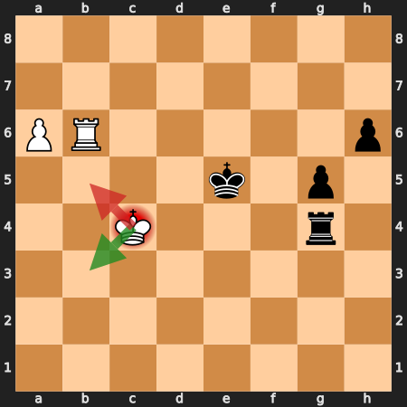

# NET-1291 round 2: independent rook-ending resources

This phase investigates a reproducible missed resource before proposing
another strength change. The baseline remains main `ce4d3f6`, engine 1.0.64,
SHA256 `1c66b5718ef2e25b9b565003fc73267ec96d9a2910f383dd3a943cc2a139237f`.
The earlier five nonpassing experiments remain documented in
[the first report](net1291-endgame-diagnosis.md).

## Frozen diagnostic sample

Seed 129113 selects 96 unique positions from 465 eligible games in the older
`v1063-scale.pgn` and `net1242-scale.pgn`. Each game contributes its first
eligible position after ply 40: six to twelve pieces, rooks on both sides,
no queens, bishops or knights. Selection does not inspect evaluations or
outcomes. Repository suite positions and the reserved confirmation set are
excluded, including colour mirrors. The source games differ from the
reserved set's `net1284-scale.pgn` source.

Manifest SHA256:
`2f5d5a99f522ab93108824214d9258a8ff1c7ded8aee09870a3d64f1249dd290`.
Counts by total pieces: 6:5, 7:5, 8:6, 9:6, 10:10, 11:12, 12:52.
The first-eligible rule favours the transition into a rook ending. These are
diagnostic positions, not an IID population survey or the reserved holdout.
All searches begin from the recorded FEN with fresh search/game history;
they do not assess repetition claims from earlier in the source game.

## Protocol registered before timed measurement

1. Record static NNUE and HCE values for all 96 positions.
2. Search each root with Rival and Stockfish at one second, one thread,
   Hash 128. If chosen moves differ, have Stockfish search each move alone
   for one second. Compare those same-engine scores, rather than subtracting
   Rival and Stockfish's differently calibrated evaluations.
3. Confirm up to eight largest apparent regrets of at least 100 cp:
   Stockfish forced branches at two and eight seconds, unrestricted Stockfish
   at eight seconds, Rival and Stash at five seconds, and Rival forced to the
   peer move at five seconds. Short teacher searches are not ground truth.
4. For cases with at least 100 cp teacher regret at both confirmation budgets
   and Rival still choosing the original move at five seconds, run isolated
   diagnostic interventions at one million nodes. Independently disable null
   move, reverse futility, razoring, futility, late-move reductions, ProbCut,
   TT cutoffs, quiescence delta pruning or quiescence SEE pruning. Also
   compare the preserved A (full qsearch draws) and C (TT depth units)
   binaries from round 1 as diagnostics, without rerunning strength tests
   or changing their nonpassing verdicts.
5. Compare the instrumented zero-mask control with the frozen production
   binary at the same node budget on every selected case. Require identical
   best move, reported score, depth, nodes and PV. Also require the unchanged
   diagnostic build to reproduce the production bench, 1,772,650 nodes.

Mechanism switches exist only under the existing diagnostics feature and
are controlled through `RIVAL_DIAG_DISABLE`. They are diagnostic ablations,
not proposed production policies. An ablation changing a move is evidence
for further localisation, not by itself proof that a particular cutoff is
unsound. The 100 reserved rook endings remain unused for confirmation of any
future passing strength candidate.

Timed runs stop the Lichess bot only after its current game ends, then wait
for an idle machine. The wrapper restarts it in `finally`. No builds run
during timed searches or benchmark matches.

## Results

The screen found 73 identical root choices and 23 disagreements. Only one,
**R2-093**, exceeded the registered 100 cp same-teacher threshold (307 cp at
one second). Longer forced searches confirmed the preference: −385 / −421 cp
for Rival's move at two / eight seconds, versus 0 for the alternative at
both budgets. Stash also chose the alternative at five seconds. Rival itself
recovered it at five seconds, so **zero positions met the registered
persistent-five-second failure criterion**. The planned ablation selection
was empty; its empty output is retained rather than relabelled a success.

This is a limited diagnostic sample, dominated by twelve-piece transitions;
it neither disproves the curated EET gap nor establishes a population error
rate. The single short-budget error became a separately labelled exploratory
depth-recovery study, described below.

## The resource: Kb3 wins; Kb5 draws

Source: `v1063-scale.pgn`, game 1403, ply 117. Original FEN:

```text
8/8/1R3k1p/P5p1/2K3P1/6r1/8/8 b - - 0 59
```

Rival's early choice was **59...Ke5?**, while both peers preferred **59...Kg7**.
In the common continuation **60.a6 Rxg4+**, the result depends on Black's
king location. With the king on g7, the seven-piece position is drawn. With
the king on e5, White has exactly one winning evasion: **61.Kb3!**. Every
other legal king move, including **61.Kb5?** from Rival's principal variation,
draws. This child position has an exact tablebase result; the original
eight-piece root was assessed by peer searches, not an exact root probe.



Critical FEN:

```text
8/8/PR5p/4k1p1/2K3r1/8/8/8 w - - 0 61
```

The [Lichess tablebase response](https://tablebase.lichess.ovh/standard?fen=8%2F8%2FPR5p%2F4k1p1%2F2K3r1%2F8%2F8%2F8+w+-+-+0+61)
reports a White win with DTZ 16. Its child category for Kb3 is `loss` from
Black's perspective; Kc3, Kd3, Kb5 and Kc5 lead to draws. Exact responses,
URLs and both king-location controls are archived in
[`tablebase.json`](net1291/round2/tablebase.json). API field semantics follow
the [server documentation](https://github.com/lichess-org/lila-tablebase#http-api).

## Reproduced at fixed node budgets

All follow-ups use one thread, Hash 128 and fresh FEN/history. Fixed-node
measurements allow the live bot to resume; no throughput comparison is made.

| Position | Node budget | Production choice |
|---|---:|---|
| Original eight-piece root | 500,000 | Kg7 |
| Original root | 1,000,000; 2,000,000; 3,000,000; 5,000,000 | Ke5 |
| Original root | 10,000,000 | Kg7 |
| Critical seven-piece check | 100,000; 300,000; 1,000,000 | Kb5 — draw |
| Critical check | 3,000,000 | Kb3 — win |

The non-monotonic root choice is more specific than simply saying Rival
needs greater depth. The principal variation at two through five million
nodes contains the drawing **...Ke5 a6 Rxg4+ Kb5** line. Searching the
critical position directly reproduces the wrong evasion. At one million
nodes, forcing Kb3 yields a six-ply reported continuation that preserves the
exact tablebase win at every checked node. Its reported score is +84, versus
+38 when Kb5 is forced; these scores are heuristic evaluations, not exact
win probabilities or a claim of full theoretical understanding.

The instrumented zero-mask binary reproduced the production bench exactly.
It also matched production's move, score, depth, nodes and PV at three
million nodes on the original root. A separate repeat of the critical
one-million-node reproducer matched its baseline output exactly.

## Mechanism controls at the critical position

Each entry below gets the same one-million-node budget from the same fresh
critical FEN. Switches disable mechanisms throughout the tree. The archived
A/C binaries are the previously tested, nonpassing round-1 candidates.

| Diagnostic intervention | Choice | Tablebase result for White |
|---|---|---|
| Production / instrumented zero-mask control | Kb5 | Draw |
| Disable null move | Kb3 | Win |
| Disable late-move reductions | Kb3 | Win |
| Disable reverse futility | Kb5 | Draw |
| Disable futility | Kb5 | Draw |
| Disable razoring | Kb5 | Draw |
| Disable ProbCut | Kb5 | Draw |
| Disable TT cutoffs | Kb5 | Draw |
| Disable quiescence delta pruning | Kb5 | Draw |
| Disable quiescence SEE pruning | Kb5 | Draw |
| Handcrafted evaluator | Kb5 | Draw |
| Previous A: full qsearch draw policy | Kb3 | Win |
| Previous C: consistent TT depth units | Kb3 | Win |

These are causal interventions on the complete search, not proof that one
particular cutoff is unsound. Several changes reveal the same resource, and
the effects depend on search context: disabling null move or using C still
leaves the original root choosing Ke5 at three million nodes. Broader root
ablations, including ones that do not fix this isolated child, are retained
in [`recovery.json`](net1291/round2/recovery.json). The old A/C strength
verdicts are unchanged; this position is not a reason to promote either.

A further tablebase check tested the straightforward zugzwang explanation.
On the first 24 plies of the optimal tablebase line, eleven Black-to-move
positions were eligible for a legal hypothetical pass (Black was not in
check). Black lost in all eleven real positions; after passing, White still
won in all eleven. No pass-to-draw example was found on that line. This does
not exclude zugzwang elsewhere in the tree, but it supplies no direct basis
for adding null-move verification on a zugzwang claim.

## Reproducer and next code-level question

Use the existing Python chess environment and the frozen baseline:

```sh
/home/chris/services/lichess-bot/.venv/bin/python \
  docs/net1291/round2/reproduce.py.txt \
  --engine /home/chris/benchmark/sprt/rival-v1.0.64 --nodes 1000000
```

Expected baseline observation: `actual: c4b5`, `found_win: false`, exit 1.
At `--nodes 3000000`, production finds `c4b3`. With the retained diagnostic
binary (`~/benchmark/net1291-round2/rival-diagnostic`), `--disable 16`
(disable LMR) finds Kb3 at one million nodes. The zero-mask diagnostic run
reproduces the baseline miss. The EPD fixture, standalone reproducer,
instrumentation patch and exact output records accompany this report.

**What is established:** an independently sampled, tablebase-confirmed
missed king evasion; a repeatable budget-dependent failure; and interacting
null-move/LMR/draw-history/TT effects that can reveal the resource.
**What is not established:** a unique offending cutoff, a general evaluator
correction, or a strength-improving production patch. The next trace should
record search windows, reductions and TT returns along the Kb3 continuation,
including a reduced scout versus full-depth verification comparison. Neither
global pruning removal nor another arbitrary constant adjustment follows
from this case alone.

All diagnostic source edits were archived then restored to baseline. Main
and the production net remain unchanged. No strength match or training run
was commissioned in round 2. The bot is active, and the 100-position reserved
confirmation set remains unused. JSON records, scripts and logs live in
[`net1291/round2/`](net1291/round2/); local binaries remain under
`~/benchmark/net1291-round2/`.

Follow-up: [round 3 traces a single reduced Ka2 scout and verifies a one-call counterfactual](net1291-round3-search-trace.md).
